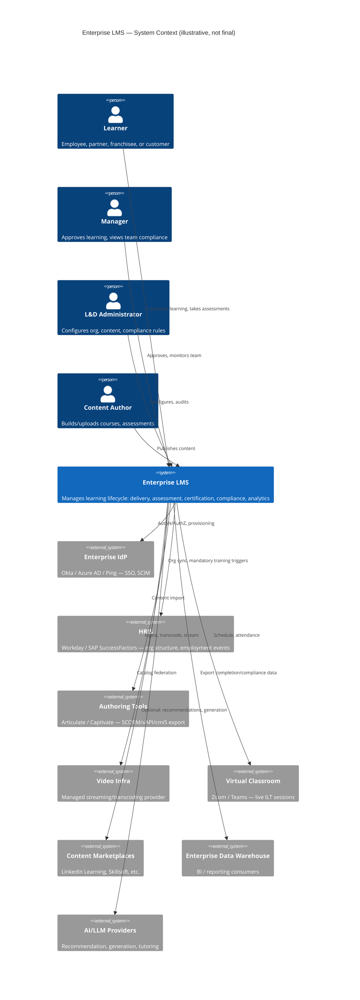

# Chapter 1 — Enterprise LMS Overview

> Part I — Foundations · [Index](../00-index.md) · Next: Chapter 2 — Business Requirements

## 1. Purpose of This Chapter

This chapter establishes the shared vocabulary, scope boundary, and guiding principles for
every subsequent chapter in this Architecture Knowledge Base (AKB). It answers three
questions before any technology or design decision is made:

1. What *is* an enterprise LMS, as distinct from adjacent categories it is routinely
   confused with?
2. What scale, deployment, and organizational assumptions govern every downstream
   decision in this AKB?
3. What thinking models and decision disciplines will be applied consistently across all
   50 chapters, so that later chapters do not need to re-justify the method?

Nothing in this chapter is a final architecture decision. It is the frame the rest of the
AKB is built inside.

---

## 2. What an Enterprise LMS Is (and Is Not)

### 2.1 Working Definition

An **Enterprise Learning Management System** is a multi-tenant, organization-hierarchy-aware
software platform that manages the full lifecycle of formal and informal learning —
content authoring/ingestion, delivery, assessment, certification, compliance tracking, and
analytics — for a workforce (employees, partners, franchisees, customers) at the scale of
tens of thousands to millions of learners, under enterprise security, governance, and audit
requirements.

The operative word is **enterprise**. This is not a feature difference from a small-business
LMS; it is a difference in the invariants the system must hold:

| Property | SMB / Academic LMS | Enterprise LMS (this AKB) |
|---|---|---|
| Tenancy | Usually single-tenant or coarse multi-tenant | Deep multi-tenancy with org-hierarchy-scoped data isolation ([Ch. 18](../part-3-identity-organization/18-multi-tenancy.md), [Ch. 19](../part-3-identity-organization/19-organization-hierarchy.md)) |
| Identity | Local accounts or single IdP | Federated identity, multiple SSO providers per tenant, SCIM provisioning ([Ch. 16](../part-3-identity-organization/16-authentication.md), [Ch. 17](../part-3-identity-organization/17-authorization.md)) |
| Compliance | Best-effort | Contractually and legally binding (SOC 2, ISO 27001, GDPR, HIPAA in some verticals, accessibility law — [Ch. 41](../part-8-operations/41-compliance.md)) |
| Availability | Best-effort uptime | Contractual SLA, typically 99.9%+, multi-region ([Ch. 42](../part-8-operations/42-disaster-recovery.md), [Ch. 43](../part-8-operations/43-scalability.md)) |
| Content model | Course = video + quiz | Competency-driven, path-based, blended (ILT + eLearning + on-the-job), often regulatory-mandated ([Ch. 20](../part-4-learning-domain/20-competency-management.md)–[Ch. 26](../part-4-learning-domain/26-certification.md)) |
| Reporting | Dashboards | Auditable, exportable, often required as legal evidence of training completion ([Ch. 32](../part-6-insight/32-reporting.md)) |
| Integration | A few webhooks | HRIS, IAM, CRM, ERP, content marketplaces, xAPI/LRS ecosystems ([Ch. 35](../part-7-platform-integration/35-integration-architecture.md)) |
| Buyer | End user / department | Procurement, Legal, Security, HR, IT — a committee, not a person |

### 2.2 Adjacent Categories This AKB Explicitly Distinguishes From

- **Learning Experience Platform (LXP)** — content-discovery-first, Netflix-style,
  typically layered *on top of* an LMS rather than replacing its system-of-record function
  (completion tracking, compliance, certification). This AKB treats LXP-style discovery as
  a capability ([Ch. 30](../part-5-media-discovery/30-recommendation-engine.md)) inside the LMS, not a separate
  product, per stakeholder decision to be validated in [Ch. 3](03-stakeholders.md).
- **Course-authoring tool** (e.g., Articulate, Adobe Captivate) — a content-producer tool.
  Out of scope as a build target; treated as an *integration* ([Ch. 35](../part-7-platform-integration/35-integration-architecture.md))
  via SCORM/xAPI/cmi5 import, not as something this platform builds.
- **HRIS / Talent Management Suite** — system of record for employment, comp, performance.
  The LMS integrates with it (roles, org structure, mandatory-training triggers) but does
  not replace it. Boundary formalized in [Ch. 11](../part-2-system-domain-architecture/11-bounded-contexts.md).
- **Video platform (e.g., internal YouTube)** — video is a *content type* the LMS manages
  ([Ch. 27](../part-5-media-discovery/27-video-streaming.md)), not the product's center of gravity.
- **Webinar / virtual classroom tool (Zoom, Teams)** — Instructor-Led Training (ILT)
  scheduling and attendance are LMS responsibilities; the live video transport itself is
  integrated, not rebuilt ([Ch. 35](../part-7-platform-integration/35-integration-architecture.md)).

Getting this boundary wrong is the single most common cause of LMS program failure
observed industry-wide: teams either rebuild a mediocre video platform, or leave
compliance/audit as an afterthought bolted onto an LXP. This AKB treats **system-of-record
compliance tracking** as the non-negotiable core, and **engagement/discovery** as a layer
on top of it — never the reverse.

---

## 3. Scale & Deployment Assumptions

These assumptions are binding for every later chapter. Any chapter that needs to deviate
from them must say so explicitly and justify it.

| Dimension | Assumption | Rationale |
|---|---|---|
| Customer profile | Fortune 500, multiple simultaneous enterprise tenants | Drives multi-tenancy, not single large deployment |
| Total learners | Up to tens of millions across tenants; single large tenant up to several million | Drives horizontal scalability targets, not vertical scaling |
| Concurrency | Bursty — quarterly compliance deadlines, new-hire cohorts, product-launch enablement spikes | Drives autoscaling and queue-based load leveling, not flat-capacity planning ([Ch. 43](../part-8-operations/43-scalability.md)) |
| Geographic footprint | Multi-region active deployment (at minimum NA, EU, APAC) | Drives data residency design, not a single-region system with a CDN bolted on ([Ch. 41](../part-8-operations/41-compliance.md), [Ch. 12](../part-2-system-domain-architecture/12-database-architecture.md)) |
| Availability | High-availability, contractual SLA-bearing | Drives active-active/active-passive topology decisions in [Ch. 42](../part-8-operations/42-disaster-recovery.md), not "best effort" |
| Maintainability horizon | 7–10 years minimum (enterprise software procurement cycles) | Drives conservative technology choices, avoidance of unproven dependencies, and explicit exit strategies in every ADR |
| Security posture | Regulated-industry-capable (finance, healthcare, government contractors as reference customers) | Drives Security-by-Design and Privacy-by-Design as constraints, not late-stage hardening ([Ch. 40](../part-8-operations/40-security.md), [Ch. 41](../part-8-operations/41-compliance.md)) |
| AI posture | AI-native from day one, but never a hard dependency for core compliance functions | Drives an architecture where AI features ([Ch. 31](../part-5-media-discovery/31-ai-integration.md)) are additive/optional at the data-model level, never required for a learner to complete and prove mandatory training |

**Explicit non-assumption:** this AKB does not assume a green-field, single implementation
team. Enterprise LMS programs routinely inherit legacy data (from a prior LMS migration),
run alongside a legacy system during cutover, and are staffed by multiple teams over years.
Migration strategy is therefore a first-class concern in every chapter's Technology
Evaluation, not an afterthought.

---

## 4. Guiding Principles

These are the standing rules every later chapter inherits. They exist so that later
chapters can say "per Chapter 1 principle N" instead of re-deriving them.

1. **Compliance-grade system of record is non-negotiable.** Completion records, certificates,
   and audit trails must be immutable, exportable, and defensible in a legal/regulatory
   audit, even if every other feature in the platform is degraded or unavailable.
2. **Multi-tenancy and data residency are architectural, not configuration.** They are
   decided at the data-model and deployment-topology level ([Ch. 12](../part-2-system-domain-architecture/12-database-architecture.md),
   [Ch. 18](../part-3-identity-organization/18-multi-tenancy.md)), not retrofitted with row-level flags.
3. **Build vs. buy vs. integrate is evaluated per capability, not per product.** No
   assumption that "we build everything" or "we buy an LMS suite." Each of the 50 domains
   gets its own Build/Buy/Integrate analysis.
4. **AI is additive, not load-bearing, for core compliance paths.** Recommendation,
   AI-authoring, and AI-tutoring ([Ch. 31](../part-5-media-discovery/31-ai-integration.md)) must degrade gracefully;
   a learner must be able to complete mandatory training with AI features fully disabled.
5. **Every technology decision carries an exit strategy.** Enterprise procurement and
   security review will ask "what happens if this vendor/OSS project disappears" — every
   ADR in this AKB answers that question up front, not reactively.
6. **Optimize for total cost of ownership, not initial velocity.** Development speed is a
   real input but is explicitly weighed against 7–10 year operational, hiring, and
   migration cost per the Technology Evaluation Template.
7. **Security and privacy are constraints on the design space, not features added later.**
   Every bounded context in [Ch. 11](../part-2-system-domain-architecture/11-bounded-contexts.md) is defined with its data
   sensitivity classification from the outset.
8. **No undocumented assumption.** If a later chapter relies on something not established
   here or in its own chapter, it must state the assumption explicitly and flag it as an
   Open Question.

---

## 5. High-Level System Context

This is a context diagram only — no internal architecture is implied yet. Internal
decomposition begins at [Ch. 9](../part-2-system-domain-architecture/09-product-architecture.md) (Product Architecture) and
[Ch. 11](../part-2-system-domain-architecture/11-bounded-contexts.md) (Bounded Contexts).

Note: `C4Context` mermaid rendering support varies by viewer; if it does not render, the
relationships above should be read as a plain system-context list. A rendering-safe
flowchart version will be produced in [Ch. 9](../part-2-system-domain-architecture/09-product-architecture.md) once internal
components exist to diagram.

---

## 6. Thinking Models Applied (and How)

Per the operating mandate, every chapter applies these simultaneously. This section
defines *what each one concretely means for this AKB*, so later chapters can invoke them by
name without re-explaining:

- **First Principles Thinking** — every domain chapter starts from "what must be true," not
  "what does Moodle do." Benchmark analysis ([Ch. 8](08-benchmark-analysis.md)) is
  descriptive input, never a substitute for deriving requirements.
- **Systems Thinking** — no chapter's decision is evaluated in isolation; each Chapter's
  "Cross References" section is mandatory, not decorative.
- **Domain-Driven Design** — vocabulary in this chapter (Learner, Tenant, Competency,
  Learning Path, Certification) is the seed of the Ubiquitous Language formalized in
  [Ch. 10](../part-2-system-domain-architecture/10-domain-driven-design.md).
- **Event Storming mindset** — later domain chapters (20–26) are expected to identify
  domain events (`LearnerEnrolled`, `AssessmentSubmitted`, `CertificateIssued`) as part of
  their design, feeding [Ch. 11](../part-2-system-domain-architecture/11-bounded-contexts.md) context maps.
- **Cost-Benefit / Opportunity Cost / TCO / CAPEX vs OPEX** — applied per the Technology
  Evaluation Template in every chapter that selects a technology.
- **Risk Analysis / Failure Mode Analysis** — every chapter's "Risks" section plus Red Team
  review.
- **Scalability Analysis** — validated against Section 3's concurrency and geographic
  assumptions specifically, not generic "it scales."
- **Security by Design / Privacy by Design** — data classification is assigned at the
  bounded-context level ([Ch. 11](../part-2-system-domain-architecture/11-bounded-contexts.md)), before any storage technology
  is chosen ([Ch. 12](../part-2-system-domain-architecture/12-database-architecture.md)).
- **DevSecOps** — security gates are part of [Ch. 39](../part-8-operations/39-devops.md) pipeline design, not a
  separate late-stage phase.
- **Vendor Lock-in / Exit Strategy / Build vs Buy vs Integrate** — mandatory subsection of
  every Technology Evaluation and every ADR.

---

## 7. Scope Boundary for This AKB

**In scope:** architecture and technology decisions for building the LMS platform itself —
backend, frontend, data, infra, security, compliance, integration, mobile, AI — sufficient
for an engineering team to implement without further architectural research.

**Out of scope (explicitly):**
- Instructional design methodology (how to write a good course) — this is a content
  discipline, not a system architecture concern.
- Specific content licensing negotiations with marketplace vendors — commercial, not
  architectural, though the *integration pattern* is in scope ([Ch. 35](../part-7-platform-integration/35-integration-architecture.md)).
- Detailed UI visual design system — [Ch. 29](../part-5-media-discovery/29-search.md)/[Ch. 30](../part-5-media-discovery/30-recommendation-engine.md)-adjacent
  UX flows are in scope; pixel-level design system is not.
- Country-by-country legal review — compliance *architecture* (data residency, consent,
  audit trail capability) is in scope ([Ch. 41](../part-8-operations/41-compliance.md)); actual legal sign-off
  per jurisdiction is not something an AKB can perform.

---

## Summary

An enterprise LMS is defined here as a multi-tenant, org-hierarchy-aware, compliance-grade
system of record for the full learning lifecycle, distinct from LXPs, authoring tools,
HRIS, video platforms, and webinar tools — each of which is an integration point, not a
component to rebuild. This AKB is scoped for Fortune 500-scale, multi-region, high-
availability deployment with a 7–10 year maintainability horizon, AI-native but not
AI-dependent for compliance-critical paths. Eight guiding principles and a consistent set
of thinking models are established here and inherited by all 49 remaining chapters.

## Open Questions

- Should the LXP-style discovery/engagement layer be a first-party capability (as assumed
  in §2.2) or should this AKB instead architect for a *pluggable* discovery layer that
  could be swapped for a third-party LXP? Revisit after [Ch. 3](03-stakeholders.md) and
  [Ch. 6](06-functional-requirements.md).
- Is "millions of users" a single-tenant ceiling, an aggregate-across-tenants figure, or
  both? This materially changes sharding strategy in [Ch. 12](../part-2-system-domain-architecture/12-database-architecture.md).
  Flagged for [Ch. 2](02-business-requirements.md) to resolve with concrete numbers.
- Which specific regulated verticals (if any) are reference customers — HIPAA (healthcare),
  FedRAMP (government), FINRA (finance)? Each adds materially different compliance
  constraints ([Ch. 41](../part-8-operations/41-compliance.md)). Not yet known; treat as unresolved until
  Chapter 2/41.

## Risks

| Risk | Impact | Likelihood | Mitigation |
|---|---|---|---|
| Scope creep into rebuilding adjacent categories (video platform, webinar tool, HRIS) | High — dilutes engineering focus, duplicates buyable capability | Medium — common industry anti-pattern | Section 2.2 boundary enforced in every chapter's Build/Buy/Integrate analysis |
| "Enterprise" assumptions (Section 3) treated as fixed when real deal requirements differ per customer | High — wrong sharding/residency decisions are expensive to reverse | Medium | [Ch. 2](02-business-requirements.md) must convert these into contractually-sourced numbers, not assumptions, before [Ch. 12](../part-2-system-domain-architecture/12-database-architecture.md) is finalized |
| AI-native ambition creates implicit dependency on AI availability for core flows | Medium — compliance risk if AI outage blocks mandatory training completion | Low if Principle 4 is enforced | [Ch. 31](../part-5-media-discovery/31-ai-integration.md) must architect AI as additive with explicit fallback paths |

## Architecture Decisions

No binding technology ADRs are made in this chapter — it defines frame, not implementation.
One scoping decision is recorded:

**ADR-000: LXP-style discovery is a capability within the LMS, not a separate product**
- *Context:* Market offers both integrated LMS+LXP suites and separate best-of-breed LXPs.
- *Status:* Provisional — pending [Ch. 3](03-stakeholders.md) and [Ch. 6](06-functional-requirements.md).
- *Rationale:* Avoids a second system-of-truth for engagement data; keeps compliance and
  discovery data consistent under one bounded-context map.
- *Rejected alternative:* Building this AKB around a "headless LMS + pluggable LXP"
  architecture from day one — rejected for now as premature; can be revisited as a
  future-roadmap item ([Ch. 50](../part-9-governance-future/50-future-roadmap.md)) without being a day-one hard
  requirement.
- *Review trigger:* Revisit if [Ch. 3](03-stakeholders.md) reveals a stakeholder mandate for
  best-of-breed LXP interchangeability.

## Future Research

- Concrete regulated-vertical reference customer profile(s) to sharpen compliance scope.
- Whether multi-tenancy should support a "single large tenant that behaves like a dedicated
  deployment" pattern (common ask from the very largest enterprise customers) — flagged for
  [Ch. 18](../part-3-identity-organization/18-multi-tenancy.md).

## Cross References
- [Ch. 2 — Business Requirements](02-business-requirements.md)
- [Ch. 3 — Stakeholders](03-stakeholders.md)
- [Ch. 8 — Benchmark Analysis](08-benchmark-analysis.md)
- [Ch. 10 — Domain-Driven Design](../part-2-system-domain-architecture/10-domain-driven-design.md)
- [Ch. 11 — Bounded Contexts](../part-2-system-domain-architecture/11-bounded-contexts.md)
- [Ch. 18 — Multi-tenancy](../part-3-identity-organization/18-multi-tenancy.md)
- [Ch. 41 — Compliance](../part-8-operations/41-compliance.md)

## Definition of Done
- [x] Enterprise LMS defined and distinguished from 5 adjacent categories
- [x] Scale/deployment assumptions tabulated and justified
- [x] 8 guiding principles stated for reuse by later chapters
- [x] System context diagram produced
- [x] Thinking models mapped to concrete AKB practices
- [x] Scope boundary (in/out) stated
- [x] Red Team / Blue Team / CTO review completed (Section 8 below)

## Confidence Level
**Medium-High.** The category definitions and scope boundary (Section 2) reflect
well-established industry consensus and are low-risk. The scale assumptions (Section 3) are
reasonable defaults for a Fortune 500-scale AKB but are explicitly flagged as provisional
pending Chapter 2's contractually-grounded numbers — confidence there is **Medium** until
that chapter resolves the Open Questions above.

---

## 8. Chapter Review

### 8.1 Red Team Review

Acting as an independent architecture review board attempting to invalidate this chapter:

- **Hidden assumption:** Section 3 assumes the buyer wants *one platform* serving *multiple
  tenants*. Some Fortune 500 buyers instead want a single-tenant dedicated deployment per
  customer for data-sovereignty reasons, which is a materially different cost and
  architecture model (dedicated infra vs. shared-with-isolation). This is not resolved
  here.
- **Unrealistic assumption:** "AI-native from day one" (Principle 4 / Section 3) is stated
  as a goal without any grounding in whether the actual first customers even want AI
  features, versus this being architecture-team enthusiasm. Flag for [Ch. 2](02-business-requirements.md)
  to confirm with real requirements, not assumed.
- **Missing requirement:** No mention yet of accessibility (WCAG/ADA/Section 508), which for
  a Fortune 500 enterprise buyer, especially government-adjacent, is frequently a
  contractual gate, not a nice-to-have. Must be elevated to an explicit requirement in
  [Ch. 6](06-functional-requirements.md)/[Ch. 7](07-non-functional-requirements.md), not
  left implicit under "Compliance."
- **Scale ambiguity risk (repeated from Open Questions):** "Millions of users" is not
  precise enough to drive [Ch. 12](../part-2-system-domain-architecture/12-database-architecture.md) sharding decisions. This
  chapter is at risk of being cited later as false precision if Chapter 2 does not sharpen
  it.

### 8.2 Blue Team Review

Defending the chapter's decisions:

- The single-tenant-per-customer concern is valid but not ignored — Section 3's "Future
  Research" and [Ch. 18](../part-3-identity-organization/18-multi-tenancy.md)'s flagged item explicitly reserve room for a
  "dedicated-feeling" tenant pattern within a shared architecture (a common resolution used
  by e.g. Salesforce/Workday-class platforms — isolate at data and compute level while
  sharing control plane). This does not need to be resolved in Chapter 1.
- AI-native positioning is deliberately hedged by Principle 4 (additive, not load-bearing)
  precisely to avoid the Red Team's concern — even if it later turns out customers don't
  want AI features, the architecture cost of having designed for optional AI is low,
  whereas retrofitting AI-readiness later into a rigid data model is expensive. This is a
  defensible asymmetric bet.
- Accessibility is a fair miss and is accepted — added as an explicit action item for
  Chapters 6/7 rather than silently deferred.

### 8.3 CTO Review

| Item | Verdict | Reasoning |
|---|---|---|
| Enterprise LMS definition & category boundary (§2) | **Approved** | Matches industry consensus; prevents predictable scope creep |
| Scale/deployment assumption table (§3) | **Approved with Conditions** | Must be re-grounded with concrete, contractually-sourced numbers in Chapter 2 before Chapter 12 (Database Architecture) is finalized |
| 8 Guiding Principles (§4) | **Approved** | Sound, reusable, each traceable to a later chapter |
| System context diagram (§5) | **Approved** | Correct abstraction level for this stage |
| Scope boundary in/out (§7) | **Approved** | Prevents the most common enterprise LMS program failure mode |
| Accessibility not yet elevated to explicit requirement | **Requires More Research** | Must appear as a first-class item, not a Compliance sub-bullet, in Chapters 6–7 |
| AI-native positioning without confirmed demand | **Approved with Conditions** | Acceptable as an architectural hedge (Principle 4 keeps it cheap to be wrong); Chapter 2 must still validate actual demand |

---

*End of Chapter 1. Proceed to [Chapter 2 — Business Requirements](02-business-requirements.md).*
