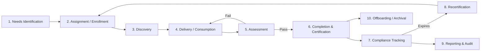
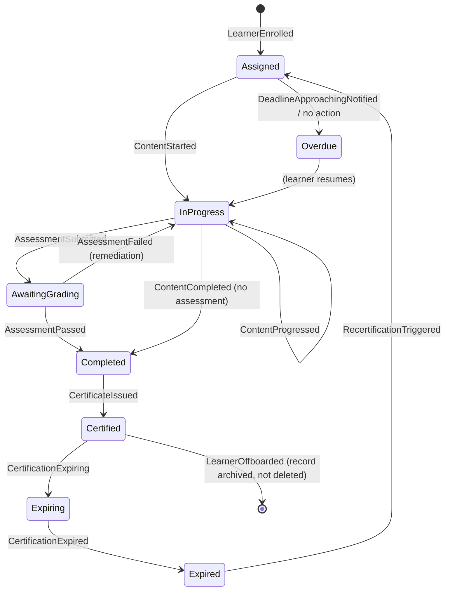

# Chapter 5 — Learning Lifecycle

> Part I — Foundations · [Index](../00-index.md) · Previous: [Ch. 4 — User Personas](04-user-personas.md) · Next: Ch. 6 — Functional Requirements

## 1. Purpose of This Chapter

Chapters 1–4 established what the system is, why it's being built, who governs it, and who
uses it. This chapter walks the **end-to-end lifecycle of a unit of learning** — from the
moment a need is identified through completion, certification, expiration, and eventual
archival — applying the Event Storming mindset (Ch. 1 §6) to surface the domain events that
[Ch. 10 — Domain-Driven Design](../part-2-system-domain-architecture/10-domain-driven-design.md) and
[Ch. 11 — Bounded Contexts](../part-2-system-domain-architecture/11-bounded-contexts.md) will formalize into a context map. This
is the last chapter of Part I before requirements are formally enumerated in
[Ch. 6](06-functional-requirements.md) — every functional requirement in that chapter
should trace back to a lifecycle phase named here.

---

## 2. Lifecycle Overview

Nine phases plus archival. Phases 2–6 repeat per learner per learning item; phases 7–9 are
continuous/ongoing background processes rather than one-time steps; phase 10 is terminal
per learner-tenant relationship, not per learning item.

---

## 3. Phase-by-Phase Detail

### 3.1 Phase 1 — Needs Identification

**Definition:** Determining that a learner (or cohort) has a learning need, either
regulatory (must complete X by law/policy) or developmental (competency gap toward a role).

| Trigger Source | Example | Primary Actor (Ch. 4 persona) |
|---|---|---|
| HRIS event | New hire, role change, location change triggers mandatory training | System (HRIS integration, [Ch. 35](../part-7-platform-integration/35-integration-architecture.md)) |
| Compliance rule engine | Annual recertification window opens | System (rules engine, [Ch. 34](../part-6-insight/34-notification-system.md)) |
| Competency gap analysis | Learner's current competency profile vs. target role profile | Admin Aisha, System ([Ch. 20](../part-4-learning-domain/20-competency-management.md)) |
| Manager nomination | Manager assigns development content | Manager Maya |
| Self-directed | Learner browses catalog for personal development | Knowledge-Worker Ken |

**Domain events:** `LearningNeedIdentified`, `ComplianceRuleTriggered`, `CompetencyGapDetected`

### 3.2 Phase 2 — Assignment / Enrollment

**Definition:** A specific learner (or cohort/org-unit) is bound to a specific learning
item (course, path, assessment) with a due date and mandatory/optional flag.

**Critical design constraint surfaced here:** assignment must be re-computable, not just a
one-time write. Org restructuring (BR-006), role changes, and rule changes (a compliance
policy update) must be able to re-evaluate and adjust assignments at scale — this is
explicitly called out because it materially shapes [Ch. 19](../part-3-identity-organization/19-organization-hierarchy.md)
and [Ch. 25](../part-4-learning-domain/25-assignment-engine.md): assignment rules must be modeled as *queries against
current org/role state*, not static snapshots, while still preserving an immutable audit
trail of what was assigned when (tension with [Ch. 26](../part-4-learning-domain/26-certification.md) immutability —
resolved by keeping the *rule* dynamic but the *assignment event* immutable once fired).

**Domain events:** `LearnerEnrolled`, `CohortAssigned`, `AssignmentDueDateSet`,
`AssignmentReassigned` (on reorg — must NOT delete prior assignment history)

### 3.3 Phase 3 — Discovery

**Definition:** Learner finds relevant content beyond what was directly assigned — search,
browse, recommendation. Optional phase (mandatory training skips straight to Phase 4).

**Domain events:** `CatalogSearched`, `ContentRecommended`, `ContentBookmarked`

Constrains: [Ch. 29](../part-5-media-discovery/29-search.md), [Ch. 30](../part-5-media-discovery/30-recommendation-engine.md). Per
[Ch. 3](03-stakeholders.md) ADR-003, this phase is the primary site of the CISO/DPO-vs-CLO
tension (recommendation quality wants behavioral data; privacy-by-design wants minimal
collection) — flagged again here as a live constraint, not resolved in this chapter.

### 3.4 Phase 4 — Delivery / Consumption

**Definition:** Learner engages with content — eLearning module, video, live ILT session,
reading material, simulation.

| Content Modality | Delivery Mechanism | Chapter |
|---|---|---|
| SCORM/xAPI/cmi5 eLearning | In-browser/app runtime player | [Ch. 22](../part-4-learning-domain/22-course-management.md), [Ch. 35](../part-7-platform-integration/35-integration-architecture.md) |
| Video | Adaptive streaming | [Ch. 27](../part-5-media-discovery/27-video-streaming.md) |
| Instructor-Led (ILT), virtual or in-person | Scheduling, roster, attendance capture | [Ch. 22](../part-4-learning-domain/22-course-management.md) |
| Documents/reading | File viewer | [Ch. 28](../part-5-media-discovery/28-file-storage.md) |
| Offline-cached content (Frontline Fiona) | Local sync, progress queued for later upload | [Ch. 37](../part-7-platform-integration/37-offline-learning.md) |

**Domain events:** `ContentStarted`, `ContentProgressed` (bookmarking position/percent),
`ContentPaused`, `SessionAttended` (ILT), `ContentCompleted`

**Design constraint:** `ContentProgressed` events for offline learners (Fiona persona, Ch.
4 §3.1) must be conflict-resolvable on sync — a learner may progress on two devices before
reconnecting. This is flagged here for [Ch. 37](../part-7-platform-integration/37-offline-learning.md) to resolve (e.g.,
highest-progress-wins or explicit merge logic), not assumed away.

### 3.5 Phase 5 — Assessment

**Definition:** Learner's knowledge/competency is evaluated — quiz, exam, practical
assignment submission, or observed checklist (for hands-on/safety training).

**Domain events:** `AssessmentStarted`, `AssessmentSubmitted`, `AssessmentGraded`,
`AssessmentPassed`, `AssessmentFailed`

Constrains: [Ch. 23](../part-4-learning-domain/23-assessment-engine.md), [Ch. 24](../part-4-learning-domain/24-question-bank.md),
[Ch. 25](../part-4-learning-domain/25-assignment-engine.md). A failed assessment routes back to Phase 4 (remediation)
per the retry/remediation policy defined at the content level, not hardcoded lifecycle
logic — this keeps the lifecycle state machine generic across content types.

### 3.6 Phase 6 — Completion & Certification

**Definition:** The learning item is marked complete, and if applicable, a certification/
credential is issued.

**Critical design constraint (ties directly to Ch. 4 Auditor Alex persona and BR-002):** a
`CertificateIssued` event must capture and permanently associate:
- The learner identity at time of issuance
- The exact content version consumed (not just "Course X" but "Course X v3.2") — this is
  the single most consequential data-modeling decision surfaced in this chapter, because
  regulated-vertical audits (Ch. 2 BR-015, financial services row) specifically require
  proof of *which version* of content was completed.
- The assessment score/result, if applicable
- The issuing tenant/org-unit context
- An immutable timestamp and, where required (BR-015 healthcare row), an e-signature

**Domain events:** `LearningItemCompleted`, `CertificateIssued`, `CertificateRevoked`
(rare — e.g., issued in error)

### 3.7 Phase 7 — Compliance Tracking (Continuous)

**Definition:** Ongoing background process reconciling all learners' assignment/completion
state against policy, surfacing gaps before deadlines, and feeding manager/admin
dashboards.

**Domain events:** `ComplianceGapDetected`, `DeadlineApproachingNotified`,
`OverdueEscalated`

Constrains: [Ch. 34](../part-6-insight/34-notification-system.md) (deadline reminders), [Ch. 32](../part-6-insight/32-reporting.md).

### 3.8 Phase 8 — Recertification / Expiration

**Definition:** Certain certifications expire (e.g., annual safety training, FINRA
continuing education) and must trigger a new cycle of Phase 2 (re-assignment).

**Domain events:** `CertificationExpiring` (advance warning), `CertificationExpired`,
`RecertificationTriggered` (loops back to Phase 2)

This is the one phase in the lifecycle that is explicitly cyclical rather than linear —
[Ch. 26 — Certification](../part-4-learning-domain/26-certification.md) must model expiration as a first-class
attribute of a certification type (nullable for non-expiring certifications), not bolt it
on as a separate reminder system disconnected from the assignment engine.

### 3.9 Phase 9 — Reporting & Audit (Continuous)

**Definition:** Cross-cutting consumption of all events above by dashboards (Manager Maya,
Admin Aisha), exports (Auditor Alex), and the enterprise data warehouse
([Ch. 35](../part-7-platform-integration/35-integration-architecture.md)).

**Design constraint:** given the event list accumulated across Phases 1–8, this chapter
recommends (for validation in [Ch. 33](../part-6-insight/33-analytics.md)) that reporting/analytics be built
as **event-sourced/CDC consumers of the domain events named in this chapter**, rather than
querying transactional tables directly at scale — flagged as a candidate architecture
decision for [Ch. 12](../part-2-system-domain-architecture/12-database-architecture.md) and [Ch. 33](../part-6-insight/33-analytics.md) to
formally evaluate (not committed here; this is a hypothesis for those chapters to test
against their own Technology Evaluation Template).

### 3.10 Phase 10 — Offboarding / Archival

**Definition:** A learner leaves the tenant organization (termination, franchise exit,
contract end). Per Chapter 2 §4 (GDPR, right to erasure) and Chapter 3's Red Team-identified
tenant data-portability gap, this phase has two competing requirements that must both be
satisfied:

1. **Compliance retention** — completion/certification records often must be *retained*
   for a regulatory period (e.g., FINRA multi-year retention) even after the individual
   leaves — cannot be simply deleted.
2. **Privacy erasure** — GDPR right-to-erasure may require removing personally identifying
   data, distinct from the *fact* that training occurred.

**Resolution surfaced here for [Ch. 41 — Compliance](../part-8-operations/41-compliance.md) to formalize:**
personal identity and compliance-evidence must be modeled as separable (e.g.,
pseudonymizable learner reference retained for audit continuity, PII erasable on request)
— this is a data-modeling implication significant enough to flag now, before
[Ch. 12 — Database Architecture](../part-2-system-domain-architecture/12-database-architecture.md) is designed, so identity
and completion-record schemas are not conflated.

**Domain events:** `LearnerOffboarded`, `RecordsArchived`, `ErasureRequested`,
`ErasureCompleted` (evidence-preserving)

---

## 4. Illustrative State Machine — Single Enrollment

---

## 5. Consolidated Domain Event Inventory (Event Storming Output)

This table is the direct, citable input to [Ch. 10](../part-2-system-domain-architecture/10-domain-driven-design.md) and
[Ch. 11 — Bounded Contexts](../part-2-system-domain-architecture/11-bounded-contexts.md):

| Event | Phase | Likely Owning Context (provisional) |
|---|---|---|
| LearningNeedIdentified, ComplianceRuleTriggered, CompetencyGapDetected | 1 | Competency Management |
| LearnerEnrolled, CohortAssigned, AssignmentReassigned | 2 | Assignment/Enrollment |
| CatalogSearched, ContentRecommended | 3 | Search / Recommendation |
| ContentStarted, ContentProgressed, SessionAttended, ContentCompleted | 4 | Course Delivery |
| AssessmentStarted, AssessmentSubmitted, AssessmentGraded | 5 | Assessment |
| CertificateIssued, CertificateRevoked | 6 | Certification |
| ComplianceGapDetected, OverdueEscalated | 7 | Compliance |
| CertificationExpiring, CertificationExpired, RecertificationTriggered | 8 | Certification / Compliance (boundary TBD in Ch. 11) |
| LearnerOffboarded, ErasureRequested, ErasureCompleted | 10 | Identity / Compliance (boundary TBD in Ch. 11) |

The "provisional" labeling is deliberate — assigning bounded-context ownership is
[Ch. 11](../part-2-system-domain-architecture/11-bounded-contexts.md)'s job specifically; this chapter's contribution is a
complete, phase-traceable event list, not the context boundaries themselves.

---

## Summary

This chapter traced ten lifecycle phases from needs identification through offboarding/
archival, producing a consolidated inventory of ~25 domain events via Event Storming. Three
significant design constraints were surfaced for downstream chapters to formally resolve:
(1) assignment rules must be dynamically re-computable against org state while individual
assignment events remain immutable, (2) content-version pinning on certificate issuance is
the most consequential data-modeling decision in the lifecycle (Phase 6), and (3) learner
identity and compliance-evidence records must be separably erasable/retainable to satisfy
GDPR erasure alongside regulatory retention (Phase 10). A provisional event-to-context
mapping is handed directly to Chapters 10–11.

## Open Questions

- Should `ContentProgressed` conflict resolution (Phase 4, offline sync) be
  highest-progress-wins, last-write-wins, or explicit merge — deferred to
  [Ch. 37](../part-7-platform-integration/37-offline-learning.md) by design, but flagged here as non-trivial enough to
  warrant dedicated design time, not a default assumption.
- Is the event-sourced/CDC hypothesis for reporting (Phase 9) actually going to be selected,
  or is it too heavy for the scale of some smaller tenants (BR-009)? Explicitly left as a
  hypothesis for [Ch. 12](../part-2-system-domain-architecture/12-database-architecture.md)/[Ch. 33](../part-6-insight/33-analytics.md) to test,
  not a decision.
- Phase 8's expiration-triggers-reassignment loop assumes the assignment engine can be
  invoked programmatically by the certification subsystem — this implies a specific
  inter-context coupling that [Ch. 11](../part-2-system-domain-architecture/11-bounded-contexts.md) must decide is a direct call,
  an async event, or a saga. Not decided here.

## Risks

| Risk | Impact | Likelihood | Mitigation |
|---|---|---|---|
| Content-version pinning (Phase 6) treated as a "nice to have" rather than foundational by an implementing team under deadline pressure | Very High — retroactively adding version-pinning to an already-live certification table is extremely costly and may itself create an audit gap | Medium | Explicitly flagged here as the single most consequential Phase 6 decision; must be reiterated in [Ch. 12](../part-2-system-domain-architecture/12-database-architecture.md) and [Ch. 26](../part-4-learning-domain/26-certification.md) as non-negotiable |
| Identity/compliance-record separability (Phase 10) not designed in from the start | High — GDPR erasure requests become technically impossible to fulfill without corrupting audit trails, or vice versa | Medium | Flagged now, before [Ch. 12](../part-2-system-domain-architecture/12-database-architecture.md), specifically to avoid retrofit |
| Assignment-rule dynamism (Phase 2) implemented as static snapshots for simplicity under schedule pressure | High — breaks BR-006 (M&A/reorg agility) | Medium | Explicit design constraint recorded in §3.2 for [Ch. 19](../part-3-identity-organization/19-organization-hierarchy.md)/[Ch. 25](../part-4-learning-domain/25-assignment-engine.md) to enforce |

## Architecture Decisions

**ADR-005: Certificates permanently pin the exact content version consumed, not just a
content identifier**
- *Context:* §3.6 — regulated-vertical audit requirements (BR-015) require proof of which
  version of content a learner completed.
- *Selected:* `CertificateIssued` events/records store an immutable reference to a specific
  content version, in addition to learner, score, and org context.
- *Rejected:* Storing only a content ID with a mutable "current version" pointer — rejected
  because it fails audit defensibility the moment content is revised after issuance (the
  exact BR-002/BR-015 failure mode this platform exists to prevent).
- *Review Trigger:* None anticipated — this is treated as a foundational, low-risk-to-affirm
  decision; only revisit if [Ch. 22](../part-4-learning-domain/22-course-management.md)'s content-versioning model
  proves technically incompatible (unlikely).

**ADR-006: Learner identity and compliance-evidence records are modeled as separable for
erasure purposes**
- *Context:* §3.10 — GDPR erasure vs. regulatory retention tension.
- *Selected:* Compliance-evidence records reference a pseudonymizable learner reference;
  PII is erasable independent of the evidentiary fact of completion.
- *Rejected:* Single denormalized learner+completion record — rejected because it makes
  erasure and retention mutually exclusive, forcing a compliance failure on one side or the
  other.
- *Review Trigger:* [Ch. 41 — Compliance](../part-8-operations/41-compliance.md) to formalize exact
  pseudonymization mechanism; [Ch. 12](../part-2-system-domain-architecture/12-database-architecture.md) to formalize schema.

## Future Research

- Offline conflict-resolution strategy for `ContentProgressed` (Ch. 37).
- Event-sourced/CDC reporting hypothesis validation (Ch. 12/33).
- Inter-context coupling mechanism for expiration→reassignment loop (Ch. 11).

## Cross References
- [Ch. 4 — User Personas](04-user-personas.md)
- [Ch. 10 — Domain-Driven Design](../part-2-system-domain-architecture/10-domain-driven-design.md)
- [Ch. 11 — Bounded Contexts](../part-2-system-domain-architecture/11-bounded-contexts.md)
- [Ch. 19 — Organization Hierarchy](../part-3-identity-organization/19-organization-hierarchy.md)
- [Ch. 25 — Assignment Engine](../part-4-learning-domain/25-assignment-engine.md)
- [Ch. 26 — Certification](../part-4-learning-domain/26-certification.md)
- [Ch. 37 — Offline Learning](../part-7-platform-integration/37-offline-learning.md)
- [Ch. 41 — Compliance](../part-8-operations/41-compliance.md)

## Definition of Done
- [x] All 10 lifecycle phases documented with triggers, actors, and domain events
- [x] Illustrative enrollment state machine produced
- [x] Consolidated, phase-traceable domain event inventory produced for Ch. 10/11
- [x] Three foundational data-modeling constraints surfaced (version-pinning, identity
      separability, dynamic assignment) ahead of Ch. 12
- [x] Red Team / Blue Team / CTO review completed

## Confidence Level
**High** for the phase structure and event inventory (§2–5) — this follows well-established
LMS/talent-management domain patterns and directly operationalizes Chapters 1–4. **Medium**
for the specific architectural hypotheses flagged as "surfaced but not decided" (event-
sourced reporting, inter-context coupling mechanism) — correctly deferred, not weakly
reasoned, but genuinely undecided pending later chapters.

---

## 6. Chapter Review

### 6.1 Red Team Review

- **Missing phase nuance:** The lifecycle assumes a single learner completes a single
  learning item somewhat independently, but **cohort/team-based learning** (e.g., a team
  completing a simulation together, or ILT with shared roster state) has group-level state
  that doesn't cleanly map to the single-enrollment state machine in §4. This is a real gap.
- **Hidden assumption:** Phase 6's version-pinning (ADR-005) assumes content versions are
  discrete and enumerable. Some content (e.g., a continuously-updated wiki-style resource,
  or AI-generated dynamic content per [Ch. 31](../part-5-media-discovery/31-ai-integration.md)) may not have clean
  version boundaries — this could conflict with ADR-005 and isn't reconciled.
- **Unaddressed edge case:** What happens to in-flight `InProgress` enrollments (§4 state
  machine) when the underlying content is updated mid-consumption? Does the learner finish
  the old version or get bumped to the new one? This has real compliance implications (does
  the resulting certificate pin the version they started or the version that existed at
  completion?) and is not addressed.

### 6.2 Blue Team Review

- Cohort/team-based learning gap is accepted as valid and material — it is a genuinely
  different state-machine shape (aggregate/group state vs. individual). Rather than
  retrofitting §4, this is correctly scoped as a distinct concern for
  [Ch. 22 — Course Management](../part-4-learning-domain/22-course-management.md) and
  [Ch. 25 — Assignment Engine](../part-4-learning-domain/25-assignment-engine.md) to model as a cohort-level
  aggregate that *contains* individual enrollment state machines, not a replacement for
  §4's model.
- The AI-generated/continuously-updated content tension with ADR-005 is accepted as a real
  edge case, but not a contradiction: ADR-005's principle ("pin what was actually consumed")
  still holds — it simply means [Ch. 31](../part-5-media-discovery/31-ai-integration.md) must define a
  version/snapshot mechanism for dynamic content specifically so it can satisfy ADR-005,
  rather than being exempt from it. This is now stated as a binding constraint on Ch. 31.
- The mid-consumption content-update edge case is accepted as a real, currently-unresolved
  gap — added as an explicit new Open Question rather than resolved speculatively here,
  since the right answer depends on content-authoring workflow details not yet defined
  ([Ch. 22](../part-4-learning-domain/22-course-management.md)).

**Corrective addenda (accepted from Red Team):**
1. New Open Question: cohort/team-based learning requires a group-level state machine
   layered above §4's individual model — scope in
   [Ch. 22](../part-4-learning-domain/22-course-management.md)/[Ch. 25](../part-4-learning-domain/25-assignment-engine.md).
2. New binding constraint on [Ch. 31 — AI Integration](../part-5-media-discovery/31-ai-integration.md): any
   dynamically-generated or continuously-updated content must define a discrete
   snapshot/version mechanism to remain compatible with ADR-005.
3. New Open Question: mid-consumption content-update behavior (learner finishes old version
   vs. bumped to new) is unresolved; assign to
   [Ch. 22 — Course Management](../part-4-learning-domain/22-course-management.md).

### 6.3 CTO Review

| Item | Verdict | Reasoning |
|---|---|---|
| 10-phase lifecycle structure (§2–3) | **Approved** | Comprehensive, correctly traces regulatory and developmental paths alike |
| Enrollment state machine (§4) | **Approved with Conditions** | Correct for individual learners; condition is explicit scoping of a cohort-level layer in Ch. 22/25 per Red Team finding |
| Domain event inventory (§5) | **Approved** | High-quality input for Ch. 10/11; provisional context-ownership labeling correctly avoids overreach |
| ADR-005 (content version pinning) | **Approved** | Correctly identified as the single most consequential Phase 6 decision; now extended with a binding constraint on Ch. 31 for dynamic content |
| ADR-006 (identity/evidence separability) | **Approved** | Directly resolves a Ch. 3 Red-Team-flagged gap (tenant data portability / erasure) before it could compound in Ch. 12 |
| Mid-consumption content-update edge case | **Requires More Research** | Genuinely open; must be resolved in [Ch. 22](../part-4-learning-domain/22-course-management.md), not guessed here |

**Action items carried forward:**
1. [Ch. 22](../part-4-learning-domain/22-course-management.md)/[Ch. 25](../part-4-learning-domain/25-assignment-engine.md) must define a
   cohort/team-level state model layered above the individual enrollment state machine.
2. [Ch. 31 — AI Integration](../part-5-media-discovery/31-ai-integration.md) must define a snapshot/version mechanism
   for dynamically-generated content to remain ADR-005-compliant.
3. [Ch. 22 — Course Management](../part-4-learning-domain/22-course-management.md) must resolve mid-consumption
   content-update behavior and its interaction with certificate version-pinning.

---

*End of Chapter 5. This closes the core narrative arc of Part I (Foundations). Chapters
6–8 (Functional Requirements, Non-Functional Requirements, Benchmark Analysis) formalize
and validate what Chapters 1–5 have established before Part II begins system decomposition.
Proceed to Chapter 6 — Functional Requirements.*
