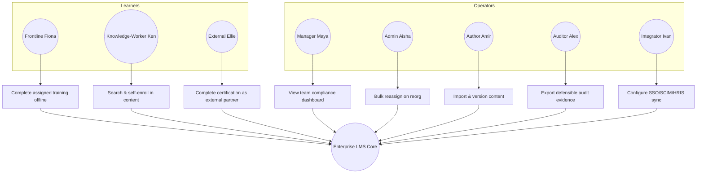

# Chapter 6 — Functional Requirements

> Part I — Foundations · [Index](../00-index.md) · Previous: [Ch. 5 — Learning Lifecycle](05-learning-lifecycle.md) · Next: Ch. 7 — Non-Functional Requirements

## 1. Purpose of This Chapter

This chapter formalizes Chapters 1–5 into numbered, prioritized, traceable **functional
requirements** (`FR-###`). Every FR cites the business requirement (`BR-###`), persona
(Ch. 4), and/or lifecycle phase (Ch. 5) that motivates it — no FR in this chapter is
permitted to originate from nowhere, per Ch. 1 Principle 8 ("no undocumented assumption").
This chapter also formally discharges three action items carried forward from earlier
chapters: tenant data-portability (Ch. 2 CTO review), cohort/team-based learning (Ch. 5 CTO
review), and bulk-operation safety for Admin Aisha (Ch. 4).

This chapter catalogs *capabilities required*, not implementation. Detailed design of each
capability is deferred to its owning Part II–VII chapter (cited per requirement group).

---

## 2. Methodology

- **Prioritization:** MoSCoW (Must / Should / Could / Won't-this-phase), consistent with
  the P0–P2 design-priority language already used in [Ch. 4](04-user-personas.md) §5.
- **Traceability:** every FR row cites `Source` (BR-ID, persona, and/or lifecycle phase) and
  `Owning Chapter`.
- **Granularity:** requirements are stated at capability level (testable, but not
  UI-specified) — acceptance-criteria-level detail belongs to the owning chapter, not here.

---

## 3. FR Group A — Identity, Access & Tenancy

| ID | Requirement | Priority | Source | Owning Chapter |
|---|---|---|---|---|
| FR-001 | System MUST support enterprise SSO (SAML2/OIDC) per tenant, with multiple IdPs configurable per tenant | Must | BR-001, CISO stakeholder (Ch.3) | [Ch. 16](../part-3-identity-organization/16-authentication.md) |
| FR-002 | System MUST support SCIM-based automated user provisioning/deprovisioning from tenant IdP/HRIS | Must | Integrator Ivan (Ch.4), BR-006 | [Ch. 16](../part-3-identity-organization/16-authentication.md), [Ch. 35](../part-7-platform-integration/35-integration-architecture.md) |
| FR-003 | System MUST support external (non-employee) identity federation distinct from employee SSO, for partner/franchisee/customer learners | Must | External Extension Ellie (Ch.4 §3.3) | [Ch. 16](../part-3-identity-organization/16-authentication.md) |
| FR-004 | System MUST enforce role-based and attribute-based access control scoped to org-hierarchy position | Must | BR-006, Ch.19 | [Ch. 17](../part-3-identity-organization/17-authorization.md), [Ch. 19](../part-3-identity-organization/19-organization-hierarchy.md) |
| FR-005 | System MUST support tenant-to-tenant data isolation with no cross-tenant data leakage under any query path | Must | Ch.1 Principle 2, CISO (Ch.3) | [Ch. 18](../part-3-identity-organization/18-multi-tenancy.md) |
| FR-006 | System MUST support re-parenting of org units/tenants without a data-migration project (M&A/restructure) | Must | BR-006 | [Ch. 18](../part-3-identity-organization/18-multi-tenancy.md), [Ch. 19](../part-3-identity-organization/19-organization-hierarchy.md) |
| **FR-007** | **System MUST provide a tenant-initiated data export capability covering all of that tenant's learner records, completions, and certificates in a documented, machine-readable format** | **Must** | **Ch.2 §9 CTO action item (tenant data-portability gap)** | [Ch. 13](../part-2-system-domain-architecture/13-api-strategy.md), [Ch. 46](../part-9-governance-future/46-licensing.md) |
| FR-008 | System MUST support break-glass/impersonation access for vendor support, fully audited and tenant-consent-gated | Should | Ch.4 §6.1 Red Team (support-impersonation persona gap) | [Ch. 48](../part-9-governance-future/48-operations.md), [Ch. 40](../part-8-operations/40-security.md) |

FR-007 formally discharges the Chapter 2 CTO review action item: *"Chapter 6 must include
an explicit tenant data-export/portability requirement, distinct from this AKB's own
vendor-lock-in exit strategy."* FR-008 formally discharges the Chapter 4 CTO review action
item regarding the vendor support-impersonation persona.

---

## 4. FR Group B — Organization & Competency

| ID | Requirement | Priority | Source | Owning Chapter |
|---|---|---|---|---|
| FR-009 | System MUST model org hierarchy synced from HRIS, supporting matrixed (dual-manager) reporting structures | Must | Manager Maya (Ch.4), BR-006 | [Ch. 19](../part-3-identity-organization/19-organization-hierarchy.md) |
| FR-010 | System MUST support competency models with proficiency levels, mapped to roles | Must | BR-004 | [Ch. 20](../part-4-learning-domain/20-competency-management.md) |
| FR-011 | System MUST compute competency gaps per learner against target role/path | Should | Lifecycle Phase 1 (Ch.5 §3.1) | [Ch. 20](../part-4-learning-domain/20-competency-management.md) |
| FR-012 | System MUST support learning paths composed of ordered/unordered mixed-modality content | Must | Lifecycle Phases 2–4 | [Ch. 21](../part-4-learning-domain/21-learning-paths.md) |

---

## 5. FR Group C — Content, Assignment & Delivery

| ID | Requirement | Priority | Source | Owning Chapter |
|---|---|---|---|---|
| FR-013 | System MUST import SCORM 1.2/2004, xAPI, and cmi5 content packages with validation feedback on import failure | Must | Author Amir (Ch.4), Ch.1 §2.2 | [Ch. 22](../part-4-learning-domain/22-course-management.md), [Ch. 35](../part-7-platform-integration/35-integration-architecture.md) |
| FR-014 | System MUST support content versioning with immutable historical versions retrievable post-update | Must | Ch.5 ADR-005 (certificate version-pinning) | [Ch. 22](../part-4-learning-domain/22-course-management.md) |
| FR-015 | System MUST support rule-based automatic assignment (role/org/compliance-trigger driven), re-evaluated on org/role change, without deleting prior assignment history | Must | Ch.5 §3.2 design constraint | [Ch. 25](../part-4-learning-domain/25-assignment-engine.md), [Ch. 19](../part-3-identity-organization/19-organization-hierarchy.md) |
| FR-016 | System MUST support bulk assignment/reassignment operations that are idempotent and safely retryable at Admin Aisha's operating scale (tenant of up to 3M learners, BR-008) | Must | Admin Aisha (Ch.4 §4.2), Ch.4 Risk register | [Ch. 13](../part-2-system-domain-architecture/13-api-strategy.md), [Ch. 19](../part-3-identity-organization/19-organization-hierarchy.md) |
| **FR-017** | **System MUST support cohort/team-level learning constructs (shared roster, group completion state) layered above individual enrollment state** | **Must** | **Ch.5 §6.1/6.3 CTO action item (cohort-based learning gap)** | [Ch. 22](../part-4-learning-domain/22-course-management.md), [Ch. 25](../part-4-learning-domain/25-assignment-engine.md) |
| FR-018 | System MUST support offline content download and deferred progress sync with defined conflict-resolution behavior | Must | Frontline Fiona (Ch.4 §3.1) | [Ch. 37](../part-7-platform-integration/37-offline-learning.md) |
| FR-019 | System MUST support adaptive-bitrate video delivery degrading gracefully on low-bandwidth connections | Must | Frontline Fiona | [Ch. 27](../part-5-media-discovery/27-video-streaming.md) |
| FR-020 | System MUST support ILT scheduling, roster management, and attendance capture (virtual and in-person) | Must | Instructor persona (Ch.3), Lifecycle Phase 4 | [Ch. 22](../part-4-learning-domain/22-course-management.md) |

FR-017 formally discharges the Chapter 5 CTO review action item regarding cohort/team-based
learning.

---

## 6. FR Group D — Assessment & Certification

| ID | Requirement | Priority | Source | Owning Chapter |
|---|---|---|---|---|
| FR-021 | System MUST support a reusable question bank with tagging, randomization, and difficulty metadata | Must | Lifecycle Phase 5 | [Ch. 24](../part-4-learning-domain/24-question-bank.md) |
| FR-022 | System MUST support configurable assessment types (quiz, timed exam, practical/observed checklist, freeform submission) | Must | BR-015 (regulated verticals) | [Ch. 23](../part-4-learning-domain/23-assessment-engine.md) |
| FR-023 | System MUST support manual grading workflows with grader assignment and audit trail, for freeform/practical assessments | Must | Instructor persona | [Ch. 23](../part-4-learning-domain/23-assessment-engine.md), [Ch. 25](../part-4-learning-domain/25-assignment-engine.md) |
| FR-024 | System MUST issue certificates that immutably pin learner identity, content version, score, org context, and timestamp | Must | Ch.5 ADR-005 | [Ch. 26](../part-4-learning-domain/26-certification.md) |
| FR-025 | System MUST support e-signature capture on assessment/certification completion where required by regulatory profile (BR-015 healthcare row) | Must | BR-015 | [Ch. 26](../part-4-learning-domain/26-certification.md), [Ch. 41](../part-8-operations/41-compliance.md) |
| FR-026 | System MUST support certification expiration and automated recertification-cycle triggering | Must | Lifecycle Phase 8 | [Ch. 26](../part-4-learning-domain/26-certification.md), [Ch. 25](../part-4-learning-domain/25-assignment-engine.md) |
| FR-027 | System MUST provide low-friction, self-explanatory certificate/record lookup and export (PDF/CSV) requiring no prior product training to use | Must | Auditor Alex (Ch.4 §4.4, §6.2 design principle) | [Ch. 26](../part-4-learning-domain/26-certification.md), [Ch. 32](../part-6-insight/32-reporting.md) |

---

## 7. FR Group E — Discovery, Recommendation & AI

| ID | Requirement | Priority | Source | Owning Chapter |
|---|---|---|---|---|
| FR-028 | System MUST support full-text and faceted search across catalogs of 100k+ items (BR-013) with sub-second response at P95 | Must | Knowledge-Worker Ken (Ch.4 §3.2) | [Ch. 29](../part-5-media-discovery/29-search.md) |
| FR-029 | System SHOULD provide personalized content recommendations, designed to satisfy data-minimization constraints (Ch.3 ADR-003) | Should | BR-016 tier 2 | [Ch. 30](../part-5-media-discovery/30-recommendation-engine.md) |
| FR-030 | System SHOULD provide AI-assisted content authoring/tagging tools for admins | Should | BR-016 tier 1 (highest confidence) | [Ch. 31](../part-5-media-discovery/31-ai-integration.md) |
| FR-031 | System COULD provide a conversational AI learning assistant, gated as fully optional and never required for mandatory-training completion | Could | BR-016 tier 3, Ch.1 Principle 4 | [Ch. 31](../part-5-media-discovery/31-ai-integration.md) |
| FR-032 | Any AI-generated or dynamically-updated content MUST support discrete snapshot/versioning compatible with certificate version-pinning (FR-024) | Must | Ch.5 §6.2/6.3 CTO action item | [Ch. 31](../part-5-media-discovery/31-ai-integration.md) |

FR-032 formally discharges the Chapter 5 CTO review action item regarding AI-generated
content and ADR-005 compatibility.

---

## 8. FR Group F — Reporting, Analytics & Notifications

| ID | Requirement | Priority | Source | Owning Chapter |
|---|---|---|---|---|
| FR-033 | System MUST provide manager-scoped compliance/competency dashboards, structurally distinct from admin configuration UI | Must | Ch.4 ADR-004 | [Ch. 32](../part-6-insight/32-reporting.md), [Ch. 14](../part-2-system-domain-architecture/14-frontend-architecture.md) |
| FR-034 | System MUST provide aggregate/cohort-level analytics distinguishable from individual-level data, to satisfy Works Council constraints in EU tenants | Must | Ch.3 §8.2/8.3 CTO action item | [Ch. 33](../part-6-insight/33-analytics.md), [Ch. 41](../part-8-operations/41-compliance.md) |
| FR-035 | System MUST provide deadline-approaching and overdue notifications across email, in-app, and mobile push channels | Must | Lifecycle Phase 7 | [Ch. 34](../part-6-insight/34-notification-system.md) |
| FR-036 | System MUST export completion/compliance data to enterprise data warehouses on a scheduled and on-demand basis | Must | Ch.2 §6 KPI feed | [Ch. 35](../part-7-platform-integration/35-integration-architecture.md) |

FR-034 formally discharges the Chapter 3 CTO review action item regarding Works Council /
individual-surveillance concerns.

---

## 9. Use-Case Overview Diagram

---

## Summary

This chapter formalized 36 functional requirements (FR-001–FR-036) across six groups —
Identity/Access/Tenancy, Organization/Competency, Content/Assignment/Delivery, Assessment/
Certification, Discovery/AI, and Reporting/Analytics/Notifications — each traced to a
business requirement, persona, or lifecycle phase from Chapters 1–5. Four prior
cross-chapter action items were formally discharged as numbered, owned requirements:
tenant data-portability (FR-007), support-impersonation access (FR-008), cohort/team-based
learning (FR-017), AI-content version compatibility (FR-032), and aggregate-vs-individual
analytics for Works Council compliance (FR-034).

## Open Questions

- FR-016's bulk-operation scale target (3M learners, BR-008) is not yet paired with a
  concrete performance SLA (e.g., "reassign 1M learners in under N minutes") — that
  quantification belongs in [Ch. 7 — Non-Functional Requirements](07-non-functional-requirements.md),
  flagged here so it isn't dropped.
- FR-031 (conversational AI assistant) is marked "Could" (lowest MoSCoW tier) consistent
  with BR-016 tier 3, but no explicit kill criteria are defined for when this should be
  formally dropped from scope vs. revisited — candidate for [Ch. 50 — Future Roadmap](../part-9-governance-future/50-future-roadmap.md).
- This FR catalog is capability-level, not acceptance-criteria-level; each owning chapter
  must produce its own acceptance criteria — risk that some chapters treat the FR statement
  itself as sufficient detail. Flagged for Red Team attention in each Part II+ chapter.

## Risks

| Risk | Impact | Likelihood | Mitigation |
|---|---|---|---|
| FR catalog treated as complete/frozen, discouraging owning chapters from surfacing new requirements during detailed design | Medium — Part II+ chapters may self-censor legitimate new findings | Low-Medium | Explicit statement in DoD below: this catalog is a floor, not a ceiling: owning chapters may add FRs with justification |
| MoSCoW "Must" items (majority of this catalog) create false equivalence — some Musts are harder/riskier than others (e.g., FR-005 tenant isolation vs. FR-020 ILT scheduling) | Medium — planning risk if treated as uniformly sized | Medium | Owning chapters' own risk/complexity analysis (per Technology Evaluation Template) is the correct place to differentiate effort, not this catalog |
| FR-007 (tenant data export) and FR-024 (immutable certificates) have a subtle tension — export format for FR-007 must itself preserve the immutability guarantees of FR-024, or an exported record could be misrepresented after export | Medium | Low | Flag explicitly for [Ch. 26](../part-4-learning-domain/26-certification.md)/[Ch. 46](../part-9-governance-future/46-licensing.md) to address (e.g., cryptographic signing of exported records) |

## Architecture Decisions

No new technology ADRs in this chapter (requirements catalog, not implementation). One
scoping decision is recorded:

**ADR-007: This FR catalog is a traceability floor, not an exhaustive specification**
- *Context:* §Open Questions — risk of owning chapters treating this catalog as complete.
- *Selected:* Each Part II+ chapter may add chapter-scoped FRs beyond this catalog, provided
  they are traced to a BR/persona/lifecycle source per this chapter's methodology (§2).
- *Rejected:* Treating Chapter 6 as the sole source of truth for all functional
  requirements platform-wide — rejected as unrealistic given the mandate for "extreme
  depth" per domain; a single chapter cannot enumerate every acceptance criterion for 44
  remaining domains.
- *Review Trigger:* If later chapters' added FRs conflict with or duplicate this catalog,
  reconcile back into this chapter's tables.

## Future Research

- Kill criteria for FR-031 (conversational AI assistant) — Ch. 50.
- Performance SLA pairing for FR-016 — Ch. 7.
- Cryptographic integrity mechanism reconciling FR-007 export with FR-024 immutability — Ch. 26/46.

## Cross References
- [Ch. 2 — Business Requirements](02-business-requirements.md)
- [Ch. 4 — User Personas](04-user-personas.md)
- [Ch. 5 — Learning Lifecycle](05-learning-lifecycle.md)
- [Ch. 7 — Non-Functional Requirements](07-non-functional-requirements.md)
- [Ch. 26 — Certification](../part-4-learning-domain/26-certification.md)
- [Ch. 46 — Licensing](../part-9-governance-future/46-licensing.md)

## Definition of Done
- [x] 36 functional requirements numbered, prioritized (MoSCoW), and traced to source
- [x] All four outstanding cross-chapter CTO action items (Ch.2, Ch.3, Ch.4, Ch.5) formally
      discharged as numbered requirements
- [x] Requirements grouped by capability area with owning chapter assigned
- [x] Explicit statement that catalog is a floor, not ceiling (ADR-007)
- [x] Use-case overview diagram produced
- [x] Red Team / Blue Team / CTO review completed

## Confidence Level
**High.** Every requirement in this catalog traces to an already-established, reviewed
source (BR-ID, persona, or lifecycle phase) rather than introducing new unreviewed
assumptions — this chapter is primarily synthesis and formalization, which is inherently
lower-risk than the earlier chapters that established the underlying facts.

---

## 10. Chapter Review

### 10.1 Red Team Review

- **New tension identified (accepted into Risks above):** FR-007 (tenant export) vs.
  FR-024 (certificate immutability) — an exported record, once outside the system's control,
  could theoretically be altered and misrepresented as authentic. This is a real gap not
  addressed in either source chapter (Ch. 2 or Ch. 5).
- **Prioritization concern:** Marking the overwhelming majority of requirements "Must"
  (28 of 36) weakens MoSCoW's actual purpose (forcing trade-off decisions). This risks
  becoming a rubber-stamp catalog rather than a genuine prioritization tool.
- **Coverage gap:** No explicit requirement yet for **multi-language/localization support**,
  which for a multi-region (Ch.1 §3), Fortune-500-scale platform is a near-certain
  requirement, not a maybe.

### 10.2 Blue Team Review

- FR-007/FR-024 tension is accepted and already captured in Risks + Future Research with a
  concrete owning-chapter assignment (Ch. 26/46) — no further action needed in this chapter
  beyond what's recorded.
- On the "too many Musts" concern: defensible in this specific case — this catalog
  represents floor-level enterprise-viability requirements (Ch.1 §3's scale/compliance
  assumptions make most of these genuinely non-negotiable for the stated market), not a
  backlog needing artificial trade-offs. The `Should`/`Could` tier is correctly reserved for
  genuinely optional capability (AI tiers, recommendations) per BR-016's own tiering. Not
  changed, but the reasoning is now made explicit rather than left implicit.
- Localization gap is accepted as valid and material — added below as a new requirement
  rather than deferred silently.

**Corrective addendum (accepted from Red Team):**

| ID | Requirement | Priority | Source | Owning Chapter |
|---|---|---|---|---|
| FR-037 | System MUST support multi-language content delivery and UI localization across at minimum the regions named in Ch.1 §3 (NA, EU, APAC) | Must | Ch.1 §3 multi-region assumption | [Ch. 14](../part-2-system-domain-architecture/14-frontend-architecture.md), [Ch. 22](../part-4-learning-domain/22-course-management.md) |

### 10.3 CTO Review

| Item | Verdict | Reasoning |
|---|---|---|
| FR catalog structure & traceability (§3–8) | **Approved** | Rigorous sourcing back to Ch.1–5; no orphaned requirements |
| Four cross-chapter action items discharged (FR-007, FR-008, FR-017, FR-032, FR-034) | **Approved** | Correctly closes the loop opened by prior chapters' CTO reviews |
| ADR-007 (catalog as floor, not ceiling) | **Approved** | Realistic given the AKB's 50-domain scope; prevents false completeness |
| FR-007/FR-024 export-integrity tension | **Requires More Research** | Must be resolved with a concrete mechanism (e.g., signed export bundles) in Ch. 26/46, not left as a stated risk indefinitely |
| Localization requirement (FR-037) | **Approved** | Correctly closes a real Fortune-500/multi-region gap |

**Action item carried forward:** [Ch. 26 — Certification](../part-4-learning-domain/26-certification.md) and
[Ch. 46 — Licensing](../part-9-governance-future/46-licensing.md) must jointly define an export-integrity mechanism
(e.g., cryptographically signed exports) reconciling FR-007 and FR-024.

---

*End of Chapter 6. Proceed to Chapter 7 — Non-Functional Requirements.*
