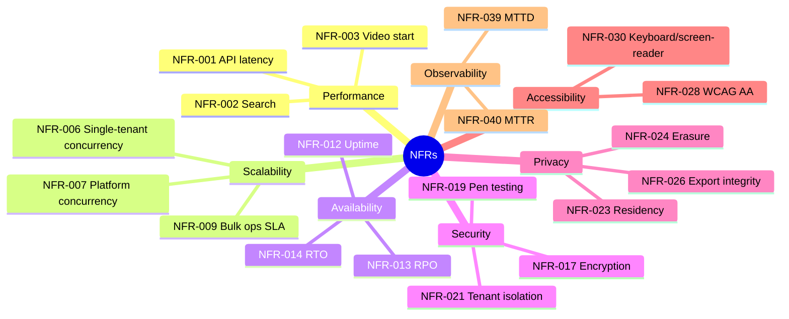

# Chapter 7 — Non-Functional Requirements

> Part I — Foundations · [Index](../00-index.md) · Previous: [Ch. 6 — Functional Requirements](06-functional-requirements.md) · Next: Ch. 8 — Benchmark Analysis

## 1. Purpose of This Chapter

Chapter 6 defined *what* the system must do. This chapter defines *how well* it must do it
— measurable, testable non-functional requirements (`NFR-###`) covering performance,
scalability, availability, security, privacy, accessibility, usability, maintainability,
observability, interoperability, localization, and cost. This chapter also formally
discharges two outstanding action items: elevating accessibility to a first-class NFR (per
[Ch. 1](01-enterprise-lms-overview.md) Red Team finding and [Ch. 2](02-business-requirements.md)
BR-015), and pairing FR-016's bulk-operation requirement with a concrete performance target
(per [Ch. 6](06-functional-requirements.md) Open Questions).

Every NFR here is stated as a **measurable target**, not an aspiration ("fast," "secure,"
"scalable" are banned words in this chapter unless immediately quantified) — consistent with
Ch. 1 Principle 8.

---

## 2. NFR Category A — Performance

| ID | Requirement | Target | Source | Owning Chapter |
|---|---|---|---|---|
| NFR-001 | API read-path latency | P95 < 300ms, P99 < 800ms under BR-010 peak load | BR-010 | [Ch. 13](../part-2-system-domain-architecture/13-api-strategy.md), [Ch. 15](../part-2-system-domain-architecture/15-backend-architecture.md) |
| NFR-002 | Search response time | P95 < 1s across a 100k+ item catalog (BR-013) | FR-028 | [Ch. 29](../part-5-media-discovery/29-search.md) |
| NFR-003 | Video start (time-to-first-frame) | P95 < 2s on broadband, P95 < 5s degraded/mobile (Frontline Fiona profile) | Ch.4 §3.1 | [Ch. 27](../part-5-media-discovery/27-video-streaming.md) |
| NFR-004 | Page/app load (first meaningful paint) | P95 < 2.5s desktop, < 3.5s mobile mid-tier Android | Ch.4 §3.1/3.2 | [Ch. 14](../part-2-system-domain-architecture/14-frontend-architecture.md) |
| NFR-005 | Assessment submission processing | P99 < 1s from submit to acknowledged, independent of grading completion time | Lifecycle Phase 5 | [Ch. 23](../part-4-learning-domain/23-assessment-engine.md) |

## 3. NFR Category B — Scalability & Capacity

| ID | Requirement | Target | Source | Owning Chapter |
|---|---|---|---|---|
| NFR-006 | Concurrent active sessions, single large tenant | Sustain 150,000 (BR-010) with no degradation beyond NFR-001 | BR-010 | [Ch. 43](../part-8-operations/43-scalability.md) |
| NFR-007 | Concurrent active sessions, platform-wide | Sustain 1,000,000 (BR-011) | BR-011 | [Ch. 43](../part-8-operations/43-scalability.md) |
| NFR-008 | Assessment submission throughput | Sustain 50,000/minute peak (BR-012) without queue backlog exceeding 2 minutes | BR-012 | [Ch. 23](../part-4-learning-domain/23-assessment-engine.md), [Ch. 43](../part-8-operations/43-scalability.md) |
| **NFR-009** | **Bulk reassignment operation (Admin Aisha, FR-016)** | **Reassign 1,000,000 learners in under 15 minutes, idempotent and safely resumable on partial failure** | **FR-016, Ch.6 Open Question** | [Ch. 19](../part-3-identity-organization/19-organization-hierarchy.md), [Ch. 13](../part-2-system-domain-architecture/13-api-strategy.md) |
| NFR-010 | Tenant onboarding provisioning time | New tenant fully provisioned (org structure + SSO + default catalog) in < 4 hours end-to-end | Integrator Ivan (Ch.4) | [Ch. 18](../part-3-identity-organization/18-multi-tenancy.md), [Ch. 35](../part-7-platform-integration/35-integration-architecture.md) |
| NFR-011 | Horizontal scale-out response time | Autoscale to absorb a 3x traffic spike (compliance-deadline pattern, Ch.1 §3) within 5 minutes | Ch.1 §3 | [Ch. 43](../part-8-operations/43-scalability.md) |

NFR-009 formally discharges the Chapter 6 Open Question pairing FR-016 with a concrete SLA.

## 4. NFR Category C — Availability, Reliability & Disaster Recovery

| ID | Requirement | Target | Source | Owning Chapter |
|---|---|---|---|---|
| NFR-012 | Platform availability (control plane + core learning delivery) | 99.9% monthly (≈43min/month downtime budget), 99.95% for compliance-critical completion recording specifically | Ch.1 §3, BR-002 | [Ch. 42](../part-8-operations/42-disaster-recovery.md), [Ch. 38](../part-8-operations/38-observability.md) |
| NFR-013 | Recovery Point Objective (RPO) — compliance/certification data | ≤ 5 minutes | BR-002, Ch.5 ADR-005/006 | [Ch. 42](../part-8-operations/42-disaster-recovery.md) |
| NFR-014 | Recovery Time Objective (RTO) — full regional failover | ≤ 30 minutes | Ch.1 §3 multi-region assumption | [Ch. 42](../part-8-operations/42-disaster-recovery.md) |
| NFR-015 | Data durability | 99.999999999% (11 nines) for stored content and completion records | BR-002 | [Ch. 12](../part-2-system-domain-architecture/12-database-architecture.md), [Ch. 28](../part-5-media-discovery/28-file-storage.md) |
| NFR-016 | Graceful degradation of AI features | Core enrollment/assessment/certification flows MUST remain fully functional with all AI features (Ch.31) unavailable | Ch.1 Principle 4 | [Ch. 31](../part-5-media-discovery/31-ai-integration.md) |

## 5. NFR Category D — Security

| ID | Requirement | Target | Source | Owning Chapter |
|---|---|---|---|---|
| NFR-017 | Encryption in transit | TLS 1.2+ enforced on all external and internal service-to-service traffic | CISO (Ch.3) | [Ch. 40](../part-8-operations/40-security.md) |
| NFR-018 | Encryption at rest | AES-256 (or equivalent) for all persisted data, tenant-key-separable where contractually required | CISO, DPO (Ch.3) | [Ch. 40](../part-8-operations/40-security.md), [Ch. 12](../part-2-system-domain-architecture/12-database-architecture.md) |
| NFR-019 | Penetration testing cadence | Independent third-party pen test at minimum annually and after any material architecture change | CISO (Ch.3) | [Ch. 40](../part-8-operations/40-security.md) |
| NFR-020 | Vulnerability remediation SLA | Critical: 72h, High: 7d, Medium: 30d from disclosure/detection | DevSecOps discipline (Ch.1 §6) | [Ch. 39](../part-8-operations/39-devops.md), [Ch. 40](../part-8-operations/40-security.md) |
| NFR-021 | Tenant data isolation verification | Automated cross-tenant isolation test suite runs on every deployment, zero tolerance for failure | FR-005 | [Ch. 18](../part-3-identity-organization/18-multi-tenancy.md), [Ch. 39](../part-8-operations/39-devops.md) |
| NFR-022 | Support-impersonation auditability | 100% of break-glass access (FR-008) logged with immutable audit trail, reviewable by tenant | FR-008 | [Ch. 48](../part-9-governance-future/48-operations.md), [Ch. 40](../part-8-operations/40-security.md) |

## 6. NFR Category E — Privacy & Compliance

| ID | Requirement | Target | Source | Owning Chapter |
|---|---|---|---|---|
| NFR-023 | Data residency enforcement | Tenant data physically stored/processed within contractually specified region, verifiable | Ch.1 §3, BR-015 (GDPR row) | [Ch. 12](../part-2-system-domain-architecture/12-database-architecture.md), [Ch. 41](../part-8-operations/41-compliance.md) |
| NFR-024 | Erasure request fulfillment (GDPR right-to-erasure) | PII erased within 30 days of verified request, while preserving pseudonymized compliance-evidence per Ch.5 ADR-006 | Ch.5 ADR-006 | [Ch. 41](../part-8-operations/41-compliance.md) |
| NFR-025 | Certification record retention | Retained per regulatory profile minimum (e.g., FINRA multi-year) even post-learner-offboarding | BR-015 (financial services row) | [Ch. 26](../part-4-learning-domain/26-certification.md), [Ch. 41](../part-8-operations/41-compliance.md) |
| NFR-026 | Export integrity | Tenant/audit exports (FR-007, FR-027) cryptographically signed to detect post-export tampering | Ch.6 §10.3 CTO action item | [Ch. 26](../part-4-learning-domain/26-certification.md), [Ch. 46](../part-9-governance-future/46-licensing.md) |
| NFR-027 | Aggregate-vs-individual analytics separation | Individual-level behavioral analytics disabled by default in tenants requiring Works Council compliance; aggregate/cohort views always available | FR-034 | [Ch. 33](../part-6-insight/33-analytics.md) |

## 7. NFR Category F — Accessibility (Formally Elevated Per Ch. 1/Ch. 2)

This category is called out on its own, not folded into Compliance, per the explicit
Chapter 1 Red Team finding and Chapter 2 BR-015 resolution requiring accessibility to be a
first-class NFR.

| ID | Requirement | Target | Source | Owning Chapter |
|---|---|---|---|---|
| NFR-028 | WCAG conformance | WCAG 2.1 Level AA across all learner- and admin-facing surfaces | BR-015 (government row), Accessibility Office (Ch.3) | [Ch. 14](../part-2-system-domain-architecture/14-frontend-architecture.md) |
| NFR-029 | Section 508 conformance | Full conformance for US federal/government-adjacent tenants | BR-015 | [Ch. 14](../part-2-system-domain-architecture/14-frontend-architecture.md), [Ch. 41](../part-8-operations/41-compliance.md) |
| NFR-030 | Screen-reader and keyboard-only operability | 100% of core learner journeys (enrollment through certification) completable without a mouse and with screen-reader announcements | NFR-028 | [Ch. 14](../part-2-system-domain-architecture/14-frontend-architecture.md) |
| NFR-031 | Captioning/transcription | 100% of video content supports closed captions; auto-generated minimum, human-reviewed for compliance-critical content | NFR-028, [Ch. 27](../part-5-media-discovery/27-video-streaming.md) | [Ch. 27](../part-5-media-discovery/27-video-streaming.md) |
| NFR-032 | Accessibility regression testing | Automated accessibility linting (axe-core or equivalent) gating every deployment; manual audit at minimum annually | NFR-028 | [Ch. 39](../part-8-operations/39-devops.md) |

## 8. NFR Category G — Usability

| ID | Requirement | Target | Source | Owning Chapter |
|---|---|---|---|---|
| NFR-033 | Frontline resume-friction budget | Resuming an in-progress course requires ≤ 3 taps from app open (Frontline Fiona) | Ch.4 §3.1 | [Ch. 36](../part-7-platform-integration/36-mobile-strategy.md) |
| NFR-034 | Auditor self-service usability | Auditor Alex's record-lookup/export workflow completable with zero prior training, measured via unmoderated usability test with < 5% task failure rate | Ch.4 §6.2 design principle | [Ch. 32](../part-6-insight/32-reporting.md), [Ch. 26](../part-4-learning-domain/26-certification.md) |
| NFR-035 | Manager dashboard cognitive load | Manager Maya's compliance overview surfaces team status in a single screen without requiring admin-level navigation depth | Ch.4 ADR-004 | [Ch. 32](../part-6-insight/32-reporting.md) |

## 9. NFR Category H — Maintainability & Extensibility

| ID | Requirement | Target | Source | Owning Chapter |
|---|---|---|---|---|
| NFR-036 | Technology maintainability horizon | All core-platform technology choices must have credible 7–10 year viability (active maintenance, hiring pool) per Ch.1 §3 | Ch.1 Principle 6 | Every Technology Evaluation, all chapters |
| NFR-037 | API versioning stability | Breaking changes require a minimum 12-month deprecation window with parallel version support | Integrator Ivan (Ch.4) | [Ch. 13](../part-2-system-domain-architecture/13-api-strategy.md) |
| NFR-038 | Modularity / bounded-context independence | Individual bounded contexts (Ch.11) independently deployable without full-platform redeploy | Ch.1 Systems Thinking | [Ch. 11](../part-2-system-domain-architecture/11-bounded-contexts.md), [Ch. 15](../part-2-system-domain-architecture/15-backend-architecture.md) |

## 10. NFR Category I — Observability & Operability

| ID | Requirement | Target | Source | Owning Chapter |
|---|---|---|---|---|
| NFR-039 | Mean time to detect (MTTD) | < 5 minutes for a P1 incident (e.g., availability breach of NFR-012) | Ch.1 §6 SRE discipline | [Ch. 38](../part-8-operations/38-observability.md) |
| NFR-040 | Mean time to resolve (MTTR) | < 1 hour for P1, < 4 hours for P2 | SRE (Ch.3) | [Ch. 38](../part-8-operations/38-observability.md) |
| NFR-041 | Distributed tracing coverage | 100% of cross-bounded-context requests traceable end-to-end | Ch.11 (bounded contexts) | [Ch. 38](../part-8-operations/38-observability.md) |
| NFR-042 | Per-tenant operational visibility | Support (Ch.3) can diagnose a single tenant's issue without querying other tenants' data | Customer Success (Ch.3) | [Ch. 38](../part-8-operations/38-observability.md), [Ch. 48](../part-9-governance-future/48-operations.md) |

## 11. NFR Category J — Interoperability

| ID | Requirement | Target | Source | Owning Chapter |
|---|---|---|---|---|
| NFR-043 | SCORM/xAPI/cmi5 conformance | Certified conformance (ADL conformance test suite) for all three standards | FR-013 | [Ch. 35](../part-7-platform-integration/35-integration-architecture.md) |
| NFR-044 | HRIS integration latency | Org/role changes reflected in LMS within 15 minutes of HRIS event (feeds FR-015 dynamic assignment) | Ch.5 §3.2 | [Ch. 35](../part-7-platform-integration/35-integration-architecture.md) |
| NFR-045 | Public API documentation completeness | 100% of public API surface documented with working sandbox examples | Integrator Ivan (Ch.4 §4.5 pain point) | [Ch. 13](../part-2-system-domain-architecture/13-api-strategy.md) |

## 12. NFR Category K — Localization

| ID | Requirement | Target | Source | Owning Chapter |
|---|---|---|---|---|
| NFR-046 | UI localization coverage | Minimum 10 languages at GA, covering NA/EU/APAC primary languages (Ch.1 §3) | FR-037 | [Ch. 14](../part-2-system-domain-architecture/14-frontend-architecture.md) |
| NFR-047 | RTL layout support | Full right-to-left layout support (Arabic/Hebrew) without visual regression | FR-037 | [Ch. 14](../part-2-system-domain-architecture/14-frontend-architecture.md) |
| NFR-048 | Locale-aware formatting | Dates, numbers, and names formatted per learner locale, independent of tenant default | FR-037 | [Ch. 14](../part-2-system-domain-architecture/14-frontend-architecture.md) |

## 13. NFR Category L — Cost Efficiency

| ID | Requirement | Target | Source | Owning Chapter |
|---|---|---|---|---|
| NFR-049 | Infrastructure cost per learner per year (steady state) | Target defined and tracked in [Ch. 45](../part-8-operations/45-cost-optimization.md); this chapter mandates the *metric exists and is monitored*, not a specific number (immature to fix now) | BR-017 | [Ch. 45](../part-8-operations/45-cost-optimization.md) |
| NFR-050 | Burst-capacity cost model | Infrastructure/vendor contracts must accommodate BR-011 peak concurrency without flat-rate over-provisioning penalty | BR-017 §7 | [Ch. 45](../part-8-operations/45-cost-optimization.md) |

---

## 14. NFR Priority & Dependency Map

---

## Summary

This chapter defined 50 measurable non-functional requirements (NFR-001–NFR-050) across
twelve categories, each traced to a business requirement, functional requirement, or
persona need. Two outstanding action items were formally discharged: accessibility
(WCAG 2.1 AA / Section 508) is now a dedicated NFR category (§7) with five specific,
testable requirements rather than a Compliance sub-bullet, and FR-016's bulk-reassignment
requirement now carries a concrete SLA (NFR-009: 1M learners in 15 minutes). A new
export-integrity requirement (NFR-026) was also added, directly addressing the FR-007/
FR-024 tension identified in Chapter 6's Red Team review.

## Open Questions

- NFR-049's cost-per-learner target is deliberately left unfixed pending
  [Ch. 45 — Cost Optimization](../part-8-operations/45-cost-optimization.md) — is a placeholder acceptable here,
  or should this chapter be revisited once Ch. 45 produces a number, to close the loop
  explicitly?
- NFR-012's differentiated SLA (99.9% platform-wide vs. 99.95% for compliance-critical
  completion recording specifically) implies an architectural separation between
  "compliance-critical path" and "everything else" — this is a significant design
  implication for [Ch. 15 — Backend Architecture](../part-2-system-domain-architecture/15-backend-architecture.md) that isn't
  yet resolved as to *how* that isolation is achieved (separate service tier? separate
  data store? Just monitored separately?).
- Several targets (NFR-001 through NFR-011 especially) are asserted without a load-testing
  methodology defined yet — [Ch. 44 — Performance Optimization](../part-8-operations/44-performance-optimization.md)
  should specify how these are validated, not just what the targets are.

## Risks

| Risk | Impact | Likelihood | Mitigation |
|---|---|---|---|
| 50 NFRs create verification burden that gets silently dropped under schedule pressure | High — NFRs are notoriously the first casualty of deadline compression | Medium-High | Recommend [Ch. 39 — DevOps](../part-8-operations/39-devops.md) encode as many as possible as automated CI/CD gates (already partially done: NFR-021, NFR-032) rather than manual review |
| NFR-012's dual-tier availability target implies architecture not yet designed, risking the harder tier (99.95%) being retrofitted rather than designed in | High | Medium | Flagged explicitly in Open Questions for [Ch. 15](../part-2-system-domain-architecture/15-backend-architecture.md) to resolve early, not late |
| Accessibility NFRs (§7) treated as a launch-blocking checklist late in the program rather than continuous (per NFR-032's own intent) | High — WCAG retrofits are notoriously expensive | Medium | NFR-032 itself mandates continuous automated gating; [Ch. 39](../part-8-operations/39-devops.md) must implement from day one of CI/CD, not pre-launch |

## Architecture Decisions

**ADR-008: Accessibility is a standalone NFR category with dedicated, testable
requirements, not a Compliance sub-bullet**
- *Context:* Ch.1 Red Team finding, Ch.2 BR-015 resolution.
- *Selected:* §7 (NFR-028–032) as a first-class category with CI/CD-gated automated testing
  (NFR-032).
- *Rejected:* Folding accessibility into Ch.41 Compliance as a narrative requirement without
  measurable targets — rejected because it was precisely this pattern that caused the
  original Ch.1 gap.
- *Review Trigger:* None anticipated; only revisit if a specific tenant's accessibility
  needs exceed WCAG 2.1 AA (e.g., AAA) and require tenant-specific NFR tiers.

**ADR-009: Compliance-critical completion-recording path carries a stricter availability
target (99.95%) than the general platform (99.9%)**
- *Context:* §4, NFR-012 — BR-002's compliance-risk-reduction driver justifies a stricter
  bar for the specific path that produces legally defensible records, even if discovery/
  recommendation features are less strictly held.
- *Selected:* Differentiated SLA tiers by criticality, to be architecturally realized in
  [Ch. 15](../part-2-system-domain-architecture/15-backend-architecture.md).
- *Rejected:* Uniform 99.9% platform-wide — rejected as under-serving the platform's core
  compliance value proposition (BR-002); also rejected 99.95% platform-wide as
  unnecessarily costly for non-critical paths (e.g., recommendations) per Ch.1 Principle 6
  (TCO discipline).
- *Review Trigger:* [Ch. 15](../part-2-system-domain-architecture/15-backend-architecture.md) to determine concrete isolation
  mechanism; revisit if proven infeasible at reasonable cost.

## Future Research

- Load-testing methodology to validate NFR-001–011 (Ch. 44).
- Concrete cost-per-learner target once real infra pricing is modeled (Ch. 45).
- Architectural mechanism for NFR-012's dual-tier availability (Ch. 15).

## Cross References
- [Ch. 1 — Enterprise LMS Overview](01-enterprise-lms-overview.md)
- [Ch. 2 — Business Requirements](02-business-requirements.md)
- [Ch. 6 — Functional Requirements](06-functional-requirements.md)
- [Ch. 15 — Backend Architecture](../part-2-system-domain-architecture/15-backend-architecture.md)
- [Ch. 39 — DevOps](../part-8-operations/39-devops.md)
- [Ch. 40 — Security](../part-8-operations/40-security.md)
- [Ch. 41 — Compliance](../part-8-operations/41-compliance.md)
- [Ch. 44 — Performance Optimization](../part-8-operations/44-performance-optimization.md)
- [Ch. 45 — Cost Optimization](../part-8-operations/45-cost-optimization.md)

## Definition of Done
- [x] 50 NFRs defined across 12 categories, each with a measurable target and traced source
- [x] Accessibility formally elevated to a standalone category (discharges Ch.1/Ch.2 action item)
- [x] FR-016 paired with a concrete bulk-operation SLA (discharges Ch.6 Open Question)
- [x] Export-integrity requirement added (discharges Ch.6 CTO action item)
- [x] Differentiated availability tiers recorded as ADR-009
- [x] Red Team / Blue Team / CTO review completed

## Confidence Level
**Medium-High.** Category structure and requirement-to-source traceability is rigorous —
**High** confidence. Specific numeric targets (latencies, SLAs, MTTD/MTTR) are informed,
defensible defaults for the stated enterprise scale but are not yet validated against real
load-testing or actual infrastructure benchmarks — **Medium** confidence on the exact
numbers, correctly flagged for revalidation in Ch. 44/45.

---

## 15. Chapter Review

### 15.1 Red Team Review

- **Unvalidated numbers:** Every latency/throughput target in §2–3 is asserted without
  citing a load test, a comparable-system benchmark, or a capacity-planning model. These
  read as plausible enterprise-grade targets but are not yet *evidence-based*.
- **Missing NFR:** No requirement addresses **third-party/vendor dependency availability**
  — e.g., what happens to NFR-012's 99.9% platform target if an integrated SSO provider
  (FR-001) or video vendor (Ch.27) has an outage? The platform's own SLA can't exceed its
  weakest critical dependency without explicit fallback design.
- **NFR-009's target (1M learners in 15 minutes) is asserted with no comparison to typical
  bulk-write throughput** of any specific database technology — this number may or may not
  be realistic and is currently just as much an assumption as Chapter 2's scale figures
  were, without Chapter 2's explicit "assumed contractual envelope" caveat.

### 15.2 Blue Team Review

- Unvalidated numbers concern is accepted as fair and already partially mitigated: the
  Confidence Level section explicitly flags numeric targets as "Medium," and Future
  Research assigns load-testing methodology to Ch. 44. This is the correct posture for a
  requirements chapter — targets are set here as the bar to design against; empirical
  validation is properly a later-chapter activity, not fabricated here.
- Third-party dependency availability gap is accepted as valid and material — this is a
  real architectural blind spot. Added below as a new NFR rather than deferred.
- NFR-009's aggressiveness is accepted as a fair flag; the number is retained as a target
  (Requirements chapters set aspirational-but-grounded targets) but the chapter's own
  Open-Questions/Confidence-Level language is tightened to make clear it needs validation,
  matching the treatment Chapter 2 gave its own scale figures.

**Corrective addendum (accepted from Red Team):**

| ID | Requirement | Target | Source | Owning Chapter |
|---|---|---|---|---|
| NFR-051 | Third-party dependency degradation handling | Platform SHALL define and test fallback/degraded-mode behavior for every critical external dependency (IdP, video vendor, HRIS) such that a single vendor outage does not breach NFR-012 for unaffected functionality | Red Team finding, Ch.1 §5 system context | [Ch. 42](../part-8-operations/42-disaster-recovery.md), [Ch. 35](../part-7-platform-integration/35-integration-architecture.md) |

### 15.3 CTO Review

| Item | Verdict | Reasoning |
|---|---|---|
| 12-category NFR structure with 50 requirements | **Approved** | Comprehensive, properly traced, appropriately caveated as targets pending validation |
| ADR-008 (accessibility as standalone category) | **Approved** | Correctly and durably closes a gap first identified in Ch. 1 |
| ADR-009 (differentiated availability tiers) | **Approved with Conditions** | Sound in principle; condition is that [Ch. 15](../part-2-system-domain-architecture/15-backend-architecture.md) must produce a concrete isolation mechanism, not leave this as an aspirational split |
| Numeric targets lacking empirical grounding | **Approved with Conditions** | Acceptable as design targets at this stage; condition is mandatory validation in [Ch. 44](../part-8-operations/44-performance-optimization.md) before being treated as contractual SLAs |
| Third-party dependency degradation gap (NFR-051) | **Approved** | Important, correctly generalized addition; binding on Ch. 35/42 |

**Action item carried forward:** [Ch. 15 — Backend Architecture](../part-2-system-domain-architecture/15-backend-architecture.md)
must define the concrete mechanism realizing NFR-012's dual-tier availability split, and
[Ch. 42](../part-8-operations/42-disaster-recovery.md)/[Ch. 35](../part-7-platform-integration/35-integration-architecture.md) must define
fallback behavior for every critical external dependency per NFR-051.

---

*End of Chapter 7. Proceed to Chapter 8 — Benchmark Analysis.*
