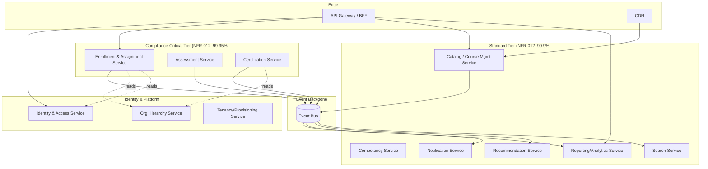

# Chapter 9 — Product Architecture

> Part II — System & Domain Architecture · [Index](../00-index.md) · Previous: [Ch. 8 — Benchmark Analysis](../part-1-foundations/08-benchmark-analysis.md) · Next: Ch. 10 — Domain-Driven Design

## 1. Purpose

Establish the macro-architecture style (how the system is decomposed and deployed at the
highest level) that Chapters 10–15 will fill in with domain, data, API, frontend, and
backend detail. This is the first Part II decision and the one every later structural
choice inherits.

## 2. Macro-Architecture Options — Technology Evaluation

| Dimension | Modular Monolith | Microservices (fine-grained) | Macroservices / "Modulith cluster" (Selected) |
|---|---|---|---|
| Overview | Single deployable, internally modularized by bounded context | Each bounded context (or smaller) is an independently deployed service | A handful of coarse-grained services aligned 1:1 with the bounded contexts from Ch. 11, each independently deployable but not fragmented below that |
| Fit to NFR-038 (independent deployability) | Fails — one deploy unit | Meets, but over-serves the requirement | Meets |
| Fit to NFR-012 (dual-tier availability, ADR-009) | Hard to isolate compliance-critical path from the rest | Meets naturally | Meets naturally |
| Fit to BR-007/008 scale (dual-dimension: single huge tenant + many tenants) | Vertical-scaling ceiling risk | Meets, at high operational cost | Meets, at moderate operational cost |
| Team/org scaling (multi-year, multi-team per Ch.1 §3) | Becomes a bottleneck past ~15-20 engineers | Scales well | Scales well |
| Operational complexity (NFR-039/040 MTTD/MTTR) | Low | High — dozens/hundreds of services, distributed-tracing-dependent | Moderate — bounded by ~15-20 services (Ch.11 context count), not hundreds |
| Cost (infra + ops + hiring, per Ch.1 Principle 6 TCO) | Lowest | Highest — service-mesh, per-service on-call, duplicated cross-cutting concerns | Moderate |
| Complexity (1-10) | 3 | 9 | 6 |
| Vendor/tech lock-in | Low | Low (but orchestration platform lock-in, e.g. K8s ecosystem) | Low |
| Exit strategy | Extract services later if needed — natural evolution path | Consolidate services if over-fragmented — costly, rarely done in practice | Split further or consolidate — both directions are lower-cost than the extremes |
| Common failure mode | "Big ball of mud" if module discipline erodes | "Distributed big ball of mud" — worse, because network calls hide the coupling | Requires genuine bounded-context discipline (Ch.11) to avoid drift |

**Decision:** Macroservices aligned 1:1 to Chapter 11's bounded contexts, not fine-grained
microservices and not a single monolith.

**Why not fine-grained microservices:** Ch.8 §5 item 9 (Cornerstone's architecture-by-
acquisition anti-pattern) and item 7 (Moodle's unbounded-plugin anti-pattern) both
independently warn against fragmentation without discipline; the operational cost curve
(NFR-039/040, hiring cost per Ch.1's TCO principle) rises steeply below ~15-20 services for
a program this AKB's team scale can sustain over the 7-10 year horizon (Ch.1 §3).

**Why not a modular monolith:** fails NFR-038 (independent deployability) and ADR-009's
dual-tier availability isolation outright — the compliance-critical completion-recording
path cannot be given a stricter SLA than discovery/recommendation if they share one deploy
unit and one failure domain.

## 3. High-Level Component Diagram

This diagram is illustrative of tier separation and event flow; exact service boundaries
are finalized in [Ch. 11 — Bounded Contexts](11-bounded-contexts.md).

## 4. Cross-Cutting Concerns Established Here

| Concern | Approach | Detailed In |
|---|---|---|
| Inter-service communication | Synchronous (REST/gRPC) for read-your-writes needs; async (event bus) for cross-context propagation of domain events from Ch.5 §5 | [Ch. 15](15-backend-architecture.md) |
| Compliance-tier isolation (ADR-009) | Separate deployment tier, separate on-call rotation, separate scaling policy; NOT separate database technology (evaluated in Ch.12) | [Ch. 15](15-backend-architecture.md) |
| Event backbone | Single logical event bus; the domain event inventory from Ch.5 §5 is the initial event catalog | [Ch. 15](15-backend-architecture.md) |
| API Gateway / BFF | Single entry point per Ch.13, fronting per-persona (Ch.4) experience needs | [Ch. 13](13-api-strategy.md) |

## Summary
Macro-architecture is a bounded-context-aligned macroservice topology (~15-20 services),
split into a compliance-critical tier (stricter SLA, ADR-009) and a standard tier, connected
via a shared event bus carrying Chapter 5's domain event inventory. Rejected: modular
monolith (fails independent deployability and SLA isolation) and fine-grained
microservices (excessive operational cost at this team's sustainable scale).

## Open Questions
- Exact service count depends on [Ch. 11](11-bounded-contexts.md)'s bounded-context map, not yet finalized.
- Event bus technology choice deferred to [Ch. 15](15-backend-architecture.md).

## Risks
| Risk | Impact | Likelihood | Mitigation |
|---|---|---|---|
| Bounded-context boundaries drift over time without governance | High | Medium | [Ch. 11](11-bounded-contexts.md) to define an explicit context-map ownership/review process |
| Compliance-tier/standard-tier split adds deployment complexity without delivering the SLA benefit if not enforced | Medium | Medium | [Ch. 15](15-backend-architecture.md) must define concrete isolation (separate clusters/namespaces at minimum) |

## Architecture Decisions
**ADR-012: Macroservices aligned 1:1 to bounded contexts, not fine-grained microservices or a modular monolith** — see §2 for full evaluation. Selected for TCO/operability balance at this AKB's team and problem scale. Rejected alternatives and rationale as tabulated above. Review trigger: revisit if Ch.11 produces a bounded-context count that makes "macroservice" and "microservice" distinctions moot (e.g., >30 contexts).

## Future Research
- Service mesh vs. simpler service-to-service auth (deferred to Ch.15).

## Cross References
[Ch. 5](../part-1-foundations/05-learning-lifecycle.md) · [Ch. 10](10-domain-driven-design.md) · [Ch. 11](11-bounded-contexts.md) · [Ch. 13](13-api-strategy.md) · [Ch. 15](15-backend-architecture.md)

## Definition of Done
- [x] Macro-architecture style selected with full alternatives evaluation
- [x] Component diagram produced with tier separation
- [x] Cross-cutting concerns enumerated with owning chapters

## Confidence Level
**Medium-High** — the monolith-vs-microservice-vs-macroservice tradeoff is well-established industry knowledge; the specific service count is provisional pending Ch. 11.

## 5. Chapter Review

**Red Team:** (1) "~15-20 services" is asserted without Ch.11 existing yet — circular pre-commitment risk. (2) No mention of how a single large tenant (BR-008, 3M learners) might need per-tenant scaling independent of the service topology — conflates service-count scaling with tenant-load scaling.

**Blue Team:** (1) Accepted — the number is a planning estimate for evaluating operational cost in §2, explicitly to be superseded by Ch.11's actual count, not a hard constraint on it. (2) Accepted as valid; noted that per-tenant scaling (replica count, not service count) is a [Ch. 43 — Scalability](../part-8-operations/43-scalability.md) concern, distinct from this chapter's service-topology decision — cross-reference added.

**CTO:** ADR-012 **Approved**. Component diagram **Approved with Conditions** (finalize against Ch.11 output). Action item: [Ch. 43](../part-8-operations/43-scalability.md) must explicitly address per-tenant scaling independent of service count.

---
*End of Chapter 9. Proceed to Chapter 10 — Domain-Driven Design.*
