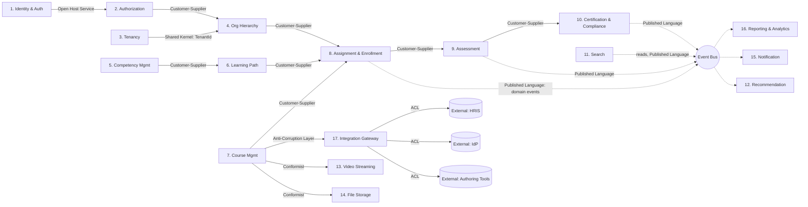

# Chapter 11 — Bounded Contexts

> Part II — System & Domain Architecture · [Index](../00-index.md) · Previous: [Ch. 10 — Domain-Driven Design](10-domain-driven-design.md) · Next: Ch. 12 — Database Architecture

## 1. Purpose

Draw the definitive context map: 17 bounded contexts, their relationships (per DDD
strategic patterns), and data-sensitivity classification (Ch.1 Principle 7) — finalizing
Chapter 9's provisional "~15-20 services" estimate and giving every subsequent Part II–VII
chapter an explicit context to own.

## 2. The 17 Bounded Contexts

| # | Context | Subdomain Type (Ch.10) | Owns Aggregates | Data Sensitivity | Owning Chapter(s) |
|---|---|---|---|---|---|
| 1 | Identity & Authentication | Generic | Session, ExternalIdentityLink | High (credentials-adjacent) | [Ch. 16](../part-3-identity-organization/16-authentication.md) |
| 2 | Authorization | Supporting | Role, Permission, PolicyBinding | High | [Ch. 17](../part-3-identity-organization/17-authorization.md) |
| 3 | Tenancy & Provisioning | Supporting | Tenant, TenantConfig | Moderate | [Ch. 18](../part-3-identity-organization/18-multi-tenancy.md) |
| 4 | Organization Hierarchy | Supporting | OrgUnit, ReportingLine | Moderate (org-structure PII-adjacent) | [Ch. 19](../part-3-identity-organization/19-organization-hierarchy.md) |
| 5 | Competency Management | **Core** | Competency, RoleProfile, CompetencyGap | Moderate | [Ch. 20](../part-4-learning-domain/20-competency-management.md) |
| 6 | Learning Path & Curriculum | **Core** | LearningPath, PathStep | Low | [Ch. 21](../part-4-learning-domain/21-learning-paths.md) |
| 7 | Course & Content Management | Supporting | Course, ContentVersion | Low (metadata), content itself may vary | [Ch. 22](../part-4-learning-domain/22-course-management.md) |
| 8 | Assignment & Enrollment | **Core** | Enrollment, Assignment, Cohort | High (individual progress = PII) | [Ch. 25](../part-4-learning-domain/25-assignment-engine.md) |
| 9 | Assessment & Question Bank | **Core** | Assessment, Question, Submission | High (scores = sensitive PII) | [Ch. 23](../part-4-learning-domain/23-assessment-engine.md), [Ch. 24](../part-4-learning-domain/24-question-bank.md) |
| 10 | Certification & Compliance | **Core** | Certificate, ComplianceRule, RecertificationCycle | **Very High** (evidentiary, immutable, regulated) | [Ch. 26](../part-4-learning-domain/26-certification.md), [Ch. 41](../part-8-operations/41-compliance.md) |
| 11 | Search | Supporting | SearchIndex (read model only) | Low | [Ch. 29](../part-5-media-discovery/29-search.md) |
| 12 | Recommendation & AI | Supporting | RecommendationModel, LearnerAffinity | High (behavioral data — Ch.3 ADR-003 tension) | [Ch. 30](../part-5-media-discovery/30-recommendation-engine.md), [Ch. 31](../part-5-media-discovery/31-ai-integration.md) |
| 13 | Video Streaming | Generic | MediaAsset, StreamSession | Low | [Ch. 27](../part-5-media-discovery/27-video-streaming.md) |
| 14 | File Storage | Generic | StoredObject | Varies by content | [Ch. 28](../part-5-media-discovery/28-file-storage.md) |
| 15 | Notification | Generic | NotificationRequest, DeliveryLog | Moderate (contact info) | [Ch. 34](../part-6-insight/34-notification-system.md) |
| 16 | Reporting & Analytics | Supporting | ReportDefinition, AnalyticsAggregate | High (aggregated PII); individual-level gated per FR-034 | [Ch. 32](../part-6-insight/32-reporting.md), [Ch. 33](../part-6-insight/33-analytics.md) |
| 17 | Integration Gateway (ACL) | Supporting | IntegrationMapping, SyncJob | Varies (pass-through) | [Ch. 35](../part-7-platform-integration/35-integration-architecture.md) |

This finalizes Chapter 9 §2's estimate at **17 services** — within the "~15-20" range
evaluated there, so Chapter 9's TCO/operability analysis stands without revision.

## 3. Context Map — Relationships

## 4. Relationship Pattern Rationale

| Relationship | Between | Why This Pattern |
|---|---|---|
| Open Host Service | Identity & Auth → Authorization | Auth exposes a stable, well-documented interface (session/identity claims) consumed by many contexts; OHS avoids N×M point-to-point coupling |
| Shared Kernel (TenantId only) | Tenancy ↔ Org Hierarchy | The `TenantId` value object is deliberately shared as the one piece of vocabulary too foundational to duplicate — kept minimal per DDD guidance to avoid Shared Kernel sprawl |
| Customer-Supplier | Org Hierarchy → Assignment; Competency → Learning Path → Assignment; Course Mgmt → Assignment; Assessment → Certification | Clear upstream/downstream with the downstream (supplier's customer) able to negotiate requirements — matches how Ch.5's lifecycle phases genuinely depend on each other in sequence |
| Published Language (domain events) | Assignment/Assessment/Certification → Event Bus → Reporting/Notification/Recommendation | Decouples the Core contexts from every consumer; consumers depend on the stable event schema (Ch.5 §5 inventory), not on the producing context's internals |
| Anti-Corruption Layer | Course Mgmt / any context → Integration Gateway → external systems | Mandated by Ch.10 §4 for every Ch.1 §2.2 integration point; the Gateway context exists specifically to contain external-model leakage |
| Conformist | Course Mgmt → Video Streaming, File Storage | These are Generic subdomains (Ch.10 §3) where this platform deliberately conforms to the chosen vendor's model rather than building an abstraction layer, since the vendor relationship itself is the buy/integrate decision (evaluated per-chapter in Ch.27/28) |

## 5. Compliance-Tier Mapping (Resolves Ch.9 Open Question)

Chapter 9 deferred which contexts belong to the compliance-critical tier (ADR-009, 99.95%
SLA). Resolved here using the data-sensitivity column above:

**Compliance-critical tier:** Assignment & Enrollment (8), Assessment & Question Bank (9),
Certification & Compliance (10) — these three directly produce the evidentiary record
chain (`LearnerEnrolled → AssessmentSubmitted → CertificateIssued`, Ch.5 §4).

**Standard tier:** all other 14 contexts.

This is the concrete resolution [Ch. 9](09-product-architecture.md) deferred to this
chapter, now closing that Open Question.

## Summary
17 bounded contexts are defined with explicit aggregate ownership, data-sensitivity
classification, and DDD relationship patterns, finalizing Chapter 9's service-count
estimate and resolving its compliance-tier-membership Open Question (3 contexts: Assignment,
Assessment, Certification). The context map enforces Anti-Corruption Layers at every
external integration point per Chapter 10's mandate.

## Open Questions
- Should Search (11) and Recommendation (12) be merged into one context given their tight
  coupling (both consume the same event stream for indexing)? Kept separate here because
  their NFRs differ materially (NFR-002 search latency vs. Ch.3 ADR-003 privacy tension for
  recommendations) — revisit if [Ch. 29](../part-5-media-discovery/29-search.md)/[Ch. 30](../part-5-media-discovery/30-recommendation-engine.md)
  find the separation artificial.
- Integration Gateway (17) as a single context risks becoming a dumping ground (echoing
  Ch.8's Moodle/Cornerstone anti-patterns) — [Ch. 35](../part-7-platform-integration/35-integration-architecture.md) must
  actively guard against this.

## Risks
| Risk | Impact | Likelihood | Mitigation |
|---|---|---|---|
| Context boundaries drift without governance (flagged already in Ch.9) | High | Medium | This chapter's table (§2) is the canonical reference; changes require an ADR, not ad hoc drift |
| Compliance-tier contexts (8,9,10) accumulate non-compliance-critical features over time, diluting the SLA rationale | Medium | Medium | [Ch. 15](15-backend-architecture.md) to enforce tier boundary at the deployment/ownership level, not just documentation |
| Integration Gateway becomes a monolithic ACL dumping ground | Medium | Medium-High (named as Open Question) | [Ch. 35](../part-7-platform-integration/35-integration-architecture.md) to define per-integration sub-module boundaries within the context |

## Architecture Decisions
**ADR-014: 17 bounded contexts finalized, with Assignment/Assessment/Certification designated the compliance-critical tier** — Context: §2, §5, resolving Ch.9's deferred tier-membership question. Rejected: merging Search+Recommendation (kept separate pending Ch.29/30 findings); a generic "Platform Services" catch-all for all Generic-subdomain contexts (rejected — Video/Storage/Notification/Identity have different enough NFRs and vendor relationships to warrant separate contexts per Ch.9's macroservice rationale). Review trigger: re-open if Ch.29/30 or Ch.35 findings contradict boundary placement.

## Future Research
Validate Search/Recommendation separation; define Integration Gateway sub-module governance.

## Cross References
[Ch. 9](09-product-architecture.md) · [Ch. 10](10-domain-driven-design.md) · [Ch. 12](12-database-architecture.md) · [Ch. 15](15-backend-architecture.md) · [Ch. 35](../part-7-platform-integration/35-integration-architecture.md)

## Definition of Done
- [x] 17 bounded contexts enumerated with aggregates, sensitivity, owning chapters
- [x] Context map with explicit DDD relationship patterns
- [x] Compliance-tier membership resolved (closes Ch.9 Open Question)

## Confidence Level
**High** for context enumeration and Core/Supporting/Generic-derived boundaries (directly inherited from Ch.10's classification). **Medium** for exact relationship-pattern choices in §4, pending validation as Part III–VII chapters implement against them.

## 6. Chapter Review

**Red Team:** Data-sensitivity classification (§2) has no formal scale defined (High/
Moderate/Low/Very High used inconsistently with no rubric) — this will make it hard for
[Ch. 40](../part-8-operations/40-security.md)/[Ch. 41](../part-8-operations/41-compliance.md) to apply consistent controls per tier.

**Blue Team:** Accepted — valid process gap. Addendum: a formal 4-tier data classification
scale (Public, Internal, Confidential-PII, Restricted-Evidentiary) with concrete handling
requirements per tier is deferred to [Ch. 40 — Security](../part-8-operations/40-security.md) as its own
deliverable, using this chapter's informal labels as a first draft input, not a final
taxonomy.

**CTO:** Approved. Action item: [Ch. 40 — Security](../part-8-operations/40-security.md) must formalize a
4-tier data classification rubric and re-map all 17 contexts against it explicitly.

---
*End of Chapter 11. Proceed to Chapter 12 — Database Architecture.*
