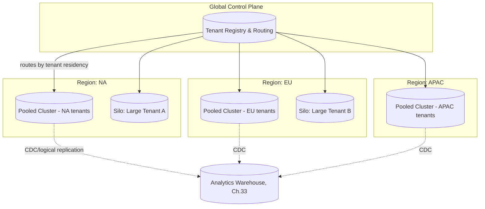

# Chapter 12 — Database Architecture

> Part II — System & Domain Architecture · [Index](../00-index.md) · Previous: [Ch. 11 — Bounded Contexts](11-bounded-contexts.md) · Next: Ch. 13 — API Strategy

## 1. Purpose

This is the chapter every prior risk register entry has pointed to. It resolves: the
tenant-isolation model (Ch.1 Open Question), the primary OLTP database technology
(Technology Evaluation Template, full form), the event-sourcing hypothesis (Ch.5 Open
Question), the sharding strategy against the dual-dimension scale target (BR-007/008), and
the concrete mechanism for identity/evidence separability (Ch.5 ADR-006) and data residency
(NFR-023).

## 2. Tenant Isolation Model

| Option | Description | Isolation Strength | Cost at BR-007 scale (many tenants) | Fit to BR-008 (3M-learner tenant) |
|---|---|---|---|---|
| Silo (DB-per-tenant) | Fully dedicated database instance per tenant | Highest | Very high — thousands of DB instances to operate | Excellent |
| Pool (shared schema, `tenant_id` column) | All tenants share tables, isolated by row-level filtering | Lowest (relies entirely on application/RLS correctness) | Lowest — one schema, easy to operate | Poor — one tenant's 3M rows dominate a shared table, noisy-neighbor risk |
| Bridge (shared instance, schema-per-tenant) | One database instance, separate schema per tenant | Moderate | Moderate | Moderate |
| **Hybrid (Selected)** | Silo for tenants above a size/regulatory threshold; pooled (with Postgres Row-Level Security as defense-in-depth) for small/medium tenants | Tunable per tenant | Moderate — most tenants pooled, only the largest siloed | Excellent for the tenants that need it |

**Decision:** Hybrid model — resolves Chapter 1's Open Question directly. Threshold:
tenants exceeding ~250,000 learners (Ch.2 BR-009's upper "typical tenant" boundary) or with
a contractual data-sovereignty/regulatory requirement (BR-015) are provisioned a **dedicated
silo** (own database cluster, still on shared infrastructure/control-plane per Ch.18); all
other tenants share **pooled, RLS-enforced** clusters, sharded further by region for data
residency (NFR-023).

**Why not pure silo:** operating potentially thousands of tenant databases (BR-007's 50M
aggregate across likely thousands of tenants at BR-009's median size) fails Ch.1 Principle 6
(TCO) and NFR-039/040 (MTTD/MTTR) — undifferentiated operational burden.

**Why not pure pool:** fails BR-008 (single tenant up to 3M learners) — a single pooled
table serving a 3M-learner tenant alongside thousands of small tenants creates severe
noisy-neighbor and blast-radius risk, and directly conflicts with large enterprise buyers'
frequent data-sovereignty demands (Ch.1 Future Research item on "dedicated-feeling" tenancy).

This is enforced additionally at the database level via **Row-Level Security (RLS)** in
pooled clusters as defense-in-depth beneath application-layer tenant scoping — directly
satisfying NFR-021 (automated cross-tenant isolation testing).

## 3. Primary OLTP Database — Technology Evaluation

| Dimension | PostgreSQL (Selected) | MySQL | CockroachDB / YugabyteDB (Distributed SQL) | DynamoDB / NoSQL |
|---|---|---|---|---|
| Overview | Mature relational DB, strong ACID, extensible (JSONB, extensions) | Mature relational DB, historically simpler feature set | Distributed SQL, automatic multi-region sharding, Postgres/SQL-compatible wire protocol | Managed key-value/document store, effectively infinite horizontal scale |
| Fit to compliance-evidentiary needs (ADR-005/006) | Excellent — mature transactional guarantees, mature JSONB for flexible metadata, append-only tables straightforward | Good, weaker JSON/extension ecosystem | Good — same relational guarantees, better native multi-region | Poor — eventual consistency and lack of multi-row transactions complicate certificate-issuance invariants |
| Fit to hybrid isolation model (§2) | Excellent — RLS is a first-class, mature feature | Weaker RLS support | Good | N/A — different isolation model entirely |
| Multi-region (Ch.1 §3) | Requires manual replication topology (logical replication, read replicas) | Same limitation | **Native**, automatic | Native (global tables) |
| Complexity (1-10) | 4 | 4 | 7 | 6 |
| Hiring pool / talent cost (Ch.1 Principle 6) | Very large, low cost | Very large, low cost | Small, high cost — niche skill | Large but AWS-specific skew |
| Operational maturity at BR-007/008 scale | Extremely well-proven (Citus extension available for horizontal sharding if needed) | Well-proven | Newer, fewer large-scale reference deployments over a 7-10yr horizon | Well-proven but architecturally mismatched to relational compliance data |
| Vendor lock-in / exit strategy | Low — open source, every cloud offers managed Postgres | Low | Moderate — smaller ecosystem, migration off is nontrivial | High — AWS-specific APIs |
| Cost (infra, at BR-011 peak) | Moderate | Moderate | Moderate-High | Usage-based, can spike unpredictably under NFR-011 burst patterns |
| Final Recommendation | **Selected** | Rejected — no compelling advantage over Postgres, smaller extension ecosystem (notably RLS, JSONB maturity) | Rejected for primary OLTP — multi-region benefit doesn't outweigh 7-10yr talent-pool/maturity risk (Ch.1 Principle 6); **reconsider as a targeted upgrade** if manual replication topology (§4) proves operationally painful in practice | Rejected — transactional/consistency needs of the compliance-critical tier (Ch.11 §5) are a poor fit |

**Decision:** PostgreSQL as the primary OLTP database across all 17 bounded contexts'
transactional stores, with per-context schema/table design, RLS for pooled tenants, and
silo-level dedicated clusters for large/regulated tenants per §2.

## 4. Multi-Region Data Topology

A tenant is pinned to a region at provisioning (NFR-010) based on contractual data-residency
requirements (NFR-023); cross-region replication is used only for global aggregate reporting
via CDC into the analytics warehouse (Ch.33), never for primary transactional data, so
NFR-023 residency is never violated by replication topology.

## 5. Resolving Chapter 5's Event-Sourcing Hypothesis

Chapter 5 flagged event-sourcing/CDC for reporting as a hypothesis to test, not a decision.
Resolution:

**Compliance-critical tier (Assignment, Assessment, Certification — Ch.11 §5):** these
three contexts' core aggregates (`Enrollment`, `Submission`, `Certificate`) **are
event-sourced** — every state transition (Ch.5 §4 state machine) is stored as an immutable
append-only event log in PostgreSQL, with materialized-view projections for query
performance. This is a strong fit, not a hedge: event sourcing gives audit-trail
immutability (BR-002) as an architectural property rather than an application-level
convention, directly hardening Ch.5 ADR-005/006.

**Standard tier (all other 14 contexts):** traditional CRUD/state-based persistence, with
**CDC (via PostgreSQL logical replication) feeding the Reporting/Analytics warehouse**
(Ch.33) — the lighter-weight half of Chapter 5's hypothesis, avoiding the operational cost
of full event sourcing where the audit-immutability property isn't required.

This resolves Chapter 5's Open Question with a split answer: event sourcing for the 3
compliance-critical contexts (where it earns its complexity), CDC-only for everything else.

## 6. Identity/Evidence Separability — Concrete Mechanism (Resolves Ch.5 ADR-006)

| Store | Contents | Erasure Behavior |
|---|---|---|
| `identity` schema (per-tenant) | PII: name, email, external IDs | Hard-deleted on verified erasure request (NFR-024) |
| `compliance_evidence` schema (per-tenant, event-sourced) | Pseudonymized `learner_ref` (UUID, no PII), certificate/assessment event log | **Never deleted** within regulatory retention window (NFR-025); `learner_ref` becomes unresolvable to a real person once `identity` row is erased, satisfying GDPR while preserving the evidentiary fact of completion |

A one-way, tenant-scoped mapping table (`learner_ref → identity.id`) is the only linkage;
deleting the `identity` row breaks re-identification without touching evidence records —
this is the concrete mechanism Ch.5 ADR-006 deferred to this chapter.

## 7. Content Versioning Storage (Resolves Ch.5 ADR-005 Mechanism)

Content metadata/version lineage lives in relational tables (Course Mgmt context, Ch.11
#7); actual content payloads (video, SCORM packages, documents) live in object storage
(Ch.28), referenced by immutable content-hash. A `content_version` row is **never updated
in place** — a new version always inserts a new row with a new hash reference, and
`Certificate` events reference the specific `content_version.id`, giving ADR-005 a concrete,
enforceable storage mechanism. This also directly satisfies Chapter 8's FR-038 (marketplace
content version-pinning): externally sourced content is hashed and versioned identically to
internally authored content, requiring no re-hosting — only a metadata snapshot — resolving
the Ch.8 Blue Team's operational-cost concern.

## Summary
PostgreSQL is selected as the primary OLTP database (over MySQL, distributed SQL, and
NoSQL) via a full technology evaluation. A hybrid silo/pool tenant-isolation model resolves
Chapter 1's Open Question. Chapter 5's event-sourcing hypothesis is resolved with a split
answer: full event sourcing for the 3 compliance-critical contexts, CDC-only for the
remaining 14. Chapter 5's ADR-006 (identity/evidence separability) and ADR-005 (content
version-pinning) both receive concrete, enforceable storage mechanisms here, and Chapter
8's FR-038 marketplace-content concern is resolved via lightweight hash-based versioning
rather than re-hosting.

## Open Questions
- Exact tenant-size threshold for silo provisioning (~250,000 learners, §2) is a reasoned
  default, not empirically validated — revisit once real tenant cost data exists (Ch.45).
- Should CockroachDB/YugabyteDB be reconsidered specifically for the 3 compliance-critical
  contexts, given their stricter availability tier (ADR-009)? Deferred to
  [Ch. 42 — Disaster Recovery](../part-8-operations/42-disaster-recovery.md) to evaluate once failover
  requirements are fully specified.

## Risks
| Risk | Impact | Likelihood | Mitigation |
|---|---|---|---|
| RLS misconfiguration in pooled clusters causes cross-tenant leakage | Very High | Low-Medium | NFR-021's automated isolation test suite is non-negotiable; must run on every deployment |
| Event-sourced compliance tier's projection/replay complexity underestimated by implementation team | High | Medium | [Ch. 15](15-backend-architecture.md) must budget explicit engineering time for projection tooling, not treat event sourcing as "just Postgres" |
| Silo threshold creates a step-function cost cliff at the 250k boundary, incentivizing gaming by sales/customer sizing | Low-Medium | Low | Flagged for [Ch. 45 — Cost Optimization](../part-8-operations/45-cost-optimization.md) to model |

## Architecture Decisions
**ADR-015: Hybrid silo/pool tenant isolation, threshold ~250k learners or regulatory need** — see §2. Resolves Ch.1 Open Question.
**ADR-016: PostgreSQL as primary OLTP database platform-wide** — see §3, full Technology Evaluation Template applied. Rejected: MySQL (no compelling advantage), CockroachDB/YugabyteDB (talent-pool/maturity risk over 7-10yr horizon per Ch.1 Principle 6, though flagged for re-evaluation on the compliance tier specifically), DynamoDB (consistency mismatch).
**ADR-017: Event sourcing for the 3 compliance-critical contexts only; CDC-only for the remaining 14** — see §5. Resolves Ch.5 Open Question with a split answer rather than an all-or-nothing platform commitment.
**ADR-018: Identity/evidence separability via a pseudonymized `learner_ref` mapping table, one-way-erasable** — see §6. Concrete mechanism for Ch.5 ADR-006.

## Future Research
Validate silo threshold against real cost data (Ch.45); re-evaluate distributed SQL for the compliance tier specifically (Ch.42).

## Cross References
[Ch. 1](../part-1-foundations/01-enterprise-lms-overview.md) · [Ch. 2](../part-1-foundations/02-business-requirements.md) · [Ch. 5](../part-1-foundations/05-learning-lifecycle.md) · [Ch. 11](11-bounded-contexts.md) · [Ch. 18](../part-3-identity-organization/18-multi-tenancy.md) · [Ch. 33](../part-6-insight/33-analytics.md) · [Ch. 41](../part-8-operations/41-compliance.md) · [Ch. 42](../part-8-operations/42-disaster-recovery.md) · [Ch. 45](../part-8-operations/45-cost-optimization.md)

## Definition of Done
- [x] Tenant isolation model decided with full alternatives evaluation (resolves Ch.1 OQ)
- [x] Primary OLTP database selected via full Technology Evaluation Template
- [x] Multi-region data topology diagrammed, satisfying NFR-023
- [x] Event-sourcing hypothesis resolved with explicit scope (resolves Ch.5 OQ)
- [x] Concrete mechanisms delivered for Ch.5 ADR-005 and ADR-006
- [x] Ch.8 FR-038 operational-cost concern resolved

## Confidence Level
**Medium-High.** PostgreSQL selection and hybrid isolation model are well-precedented, low-risk choices for this scale — **High** confidence. The silo threshold and event-sourcing scope decisions are reasoned but not empirically validated — **Medium** confidence, explicitly flagged for revalidation.

## 8. Chapter Review

**Red Team:** (1) RLS-as-defense-in-depth is asserted but Postgres RLS has known performance
overhead at high query volume (NFR-001 P95<300ms) that isn't evaluated here — could
conflict with performance NFRs at pooled-cluster scale. (2) No disaster-recovery
implication of the silo model is addressed — thousands of small silos vs. one pooled
cluster have very different backup/restore operational profiles, deferred entirely to
Ch.42 without flagging the interaction here.

**Blue Team:** (1) Accepted as a valid, testable concern — added as a new Risk (below)
rather than dismissed; RLS overhead is real but manageable with proper indexing on
`tenant_id`, a detail for [Ch. 15](15-backend-architecture.md) to implement carefully, not
a reason to abandon RLS as defense-in-depth. (2) Accepted — cross-reference added; this
chapter should not have deferred DR implications silently.

**Corrective addendum:** New risk — *RLS overhead on high-volume pooled tables may
challenge NFR-001's P95 latency target without careful `tenant_id`-first composite
indexing; must be load-tested per [Ch. 44](../part-8-operations/44-performance-optimization.md).* New cross-
reference: [Ch. 42 — Disaster Recovery](../part-8-operations/42-disaster-recovery.md) must explicitly address
backup/restore operational differences between the silo and pool models (§2), not treat
tenant isolation as DR-neutral.

**CTO:** ADR-015/016/017/018 all **Approved**. Action items: (1)
[Ch. 44](../part-8-operations/44-performance-optimization.md) to load-test RLS overhead against NFR-001; (2)
[Ch. 42](../part-8-operations/42-disaster-recovery.md) to address silo-vs-pool backup/restore operational
differences explicitly.

---
*End of Chapter 12. Proceed to Chapter 13 — API Strategy.*
