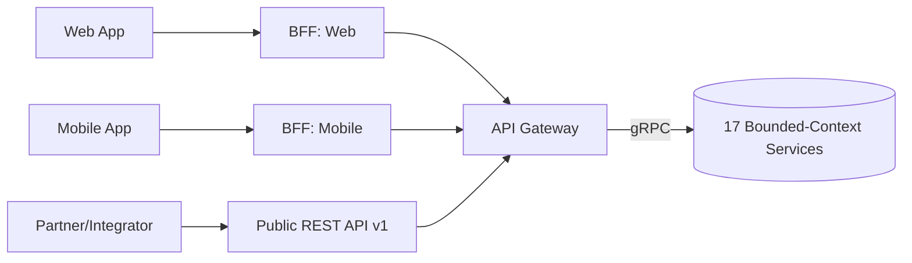

# Chapter 13 — API Strategy

> Part II — System & Domain Architecture · [Index](../00-index.md) · Previous: [Ch. 12 — Database Architecture](12-database-architecture.md) · Next: Ch. 14 — Frontend Architecture

## 1. Purpose

Define the API paradigm, versioning, gateway topology, and bulk/idempotency design that
satisfies FR-007 (tenant export), FR-016 (bulk reassignment), NFR-009 (bulk SLA), NFR-037
(versioning stability), and NFR-045 (documentation completeness for Integrator Ivan, Ch.4).

## 2. API Paradigm — Technology Evaluation

| Dimension | REST (Selected, primary) | GraphQL | gRPC |
|---|---|---|---|
| Fit to external/partner API (Integrator Ivan, FR-007) | Excellent — universally understood, easy sandboxing (NFR-045) | Good but steeper learning curve for external integrators | Poor — not web-friendly for external consumers |
| Fit to internal service-to-service (Ch.9 macroservices) | Good | Good | **Excellent** — used as secondary internal-only protocol |
| Caching (CDN-friendly, NFR-004) | Excellent (HTTP caching semantics) | Poor (single endpoint, harder to cache) | N/A |
| Versioning maturity (NFR-037) | Well-understood patterns (URI/header versioning) | Schema evolution is its own discipline, less familiar org-wide | Protobuf versioning well-understood |
| Complexity (1-10) | 3 | 6 | 5 |
| Hiring pool | Very large | Large, growing | Moderate, backend-specialist skew |
| Final recommendation | **Selected for all external and BFF-facing APIs** | Rejected as primary — evaluated again narrowly for the Frontend BFF layer in [Ch. 14](14-frontend-architecture.md) if aggregation needs justify it | **Selected for internal service-to-service calls only** (Ch.9 §4), never external |

**Decision:** REST (OpenAPI 3.x-documented) for all tenant/partner-facing and BFF APIs;
gRPC for internal macroservice-to-macroservice synchronous calls; the event bus (Ch.9 §4)
for asynchronous cross-context communication. GraphQL is not adopted platform-wide but is
not foreclosed for a future frontend-aggregation BFF if [Ch. 14](14-frontend-architecture.md)
finds a strong enough case — decision deferred there, not decided here, to avoid
prematurely locking a pattern this chapter doesn't have full context to evaluate.

## 3. Versioning Strategy (Satisfies NFR-037)

URI-path major versioning (`/v1/...`), minor/patch changes additive-only (no breaking
changes without a version bump). Deprecated versions supported a minimum 12 months in
parallel per NFR-037, with deprecation headers (`Sunset`, `Deprecation`) surfaced
programmatically — not just in documentation — so Integrator Ivan's tooling can detect
upcoming breaks automatically.

## 4. Idempotency & Bulk Operations (Satisfies FR-016 / NFR-009)

| Requirement | Mechanism |
|---|---|
| Idempotent bulk reassignment (FR-016) | Client-supplied `Idempotency-Key` header; server persists operation result keyed by (tenant, key) for 24h, replays identical response on retry rather than re-executing |
| 1M-learner/15-minute SLA (NFR-009) | Bulk endpoints are async: POST returns a job handle immediately; actual work is queued and processed by the owning macroservice (e.g., Org Hierarchy, Ch.11 #4) with horizontal worker scaling; client polls or receives a webhook on completion |
| Partial-failure safety | Bulk jobs process in idempotent, resumable batches (e.g., 10k records/batch) with per-batch checkpointing, so a mid-job failure resumes rather than restarts |

## 5. Tenant Export API (Satisfies FR-007)

A dedicated `/v1/exports` resource, tenant-admin-authenticated, generating signed
(NFR-026), downloadable bundles of that tenant's learner records, completions, and
certificates in a documented JSON/CSV schema — explicitly designed to be usable without
vendor support (discharging the Ch.2 tenant-portability gap as a self-service capability,
not a support-ticket-driven process).

## 6. API Gateway / BFF Topology

Separate BFFs for web and mobile (per Ch.4 persona device profiles — Fiona's offline/
bandwidth needs differ materially from Ken's desktop usage) avoid a one-size-fits-all
public API becoming a UX bottleneck, while the Public REST API remains the single stable
contract for Integrator Ivan, decoupled from internal BFF churn.

## Summary
REST is selected as the primary external/BFF API paradigm with gRPC for internal
service-to-service calls; GraphQL adoption is explicitly deferred to Chapter 14 rather than
decided prematurely. Idempotency-key-based, async, checkpointed bulk operations satisfy
FR-016/NFR-009's 1M-learner/15-minute target. A dedicated, self-service, signed export API
satisfies FR-007. Separate web/mobile BFFs sit in front of the stable Public API and the 17
bounded-context services.

## Open Questions
GraphQL-for-BFF decision deferred to Ch.14. Exact bulk-batch size (10k) is a starting assumption pending load testing (Ch.44).

## Risks
| Risk | Impact | Likelihood | Mitigation |
|---|---|---|---|
| Idempotency-key store becomes a bottleneck/single point of failure for all bulk operations | Medium | Low-Medium | [Ch. 15](15-backend-architecture.md) to specify a highly-available store (e.g., Postgres table with TTL cleanup, not a bespoke service) |
| Public API and internal gRPC contracts drift, causing BFF translation bugs | Medium | Medium | Contract testing mandated in [Ch. 39 — DevOps](../part-8-operations/39-devops.md) CI pipeline |

## Architecture Decisions
**ADR-019: REST (external/BFF) + gRPC (internal) as the platform's API paradigms; GraphQL deferred, not adopted platform-wide** — see §2. **ADR-020: Idempotency-key + async-job pattern for all bulk operations** — see §4, satisfies NFR-009.

## Future Research
GraphQL BFF evaluation (Ch.14); bulk-batch sizing validation (Ch.44).

## Cross References
[Ch. 6](../part-1-foundations/06-functional-requirements.md) (FR-007, FR-016) · [Ch. 7](../part-1-foundations/07-non-functional-requirements.md) (NFR-009, NFR-037, NFR-045) · [Ch. 9](09-product-architecture.md) · [Ch. 14](14-frontend-architecture.md) · [Ch. 15](15-backend-architecture.md)

## Definition of Done
- [x] API paradigm selected with alternatives evaluation
- [x] Versioning strategy defined against NFR-037
- [x] Bulk/idempotency mechanism defined against FR-016/NFR-009
- [x] Tenant export API defined against FR-007
- [x] Gateway/BFF topology diagrammed

## Confidence Level
**High** — REST/gRPC split is a well-proven industry pattern at this scale; idempotency-key bulk pattern is similarly standard.

## 7. Chapter Review

**Red Team:** Separate web/mobile BFFs (§6) risk duplicating business logic across two BFF
codebases if not disciplined — a known BFF anti-pattern.

**Blue Team:** Accepted; addendum — BFFs must remain thin translation/aggregation layers
only, with all business logic living in the 17 bounded-context services, enforced by
[Ch. 15](15-backend-architecture.md) code-ownership boundaries, not by this chapter alone.

**CTO:** ADR-019/020 **Approved**. Action item: [Ch. 15](15-backend-architecture.md) to
codify a "BFFs are dumb" architectural rule.

---
*End of Chapter 13. Proceed to Chapter 14 — Frontend Architecture.*
