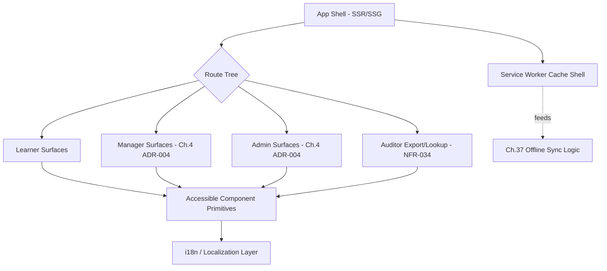

# Chapter 14 — Frontend Architecture

> Part II — System & Domain Architecture · [Index](../00-index.md) · Previous: [Ch. 13 — API Strategy](13-api-strategy.md) · Next: Ch. 15 — Backend Architecture

## 1. Purpose

Select the web frontend framework and architecture pattern satisfying accessibility
(NFR-028–032), localization (NFR-046–048), the Manager/Admin UI separation (Ch.4 ADR-004),
and persona-driven performance budgets (NFR-004, NFR-033), while resolving Chapter 13's
deferred BFF-paradigm question.

## 2. Framework Selection — Technology Evaluation

| Dimension | React (Selected) | Vue | Angular | Svelte |
|---|---|---|---|---|
| Accessibility ecosystem (NFR-028) | Mature (react-aria, Radix primitives) | Good, smaller ecosystem | Mature (Angular CDK a11y) | Immature ecosystem |
| Hiring pool (Ch.1 Principle 6, 7-10yr horizon) | Largest | Large | Large, enterprise-skew | Small |
| Enterprise-scale state management maturity | Very mature (Redux/Zustand/Query ecosystem) | Mature (Pinia) | Mature but framework-prescribed (RxJS-heavy) | Immature at this scale |
| Component reuse across Web BFF/Mobile (React Native, Ch.36) | **Strong — shared logic/patterns with React Native** | None (no direct Vue-native mobile path) | None | None |
| Complexity (1-10) | 5 | 4 | 7 | 3 |
| Long-term viability (7-10yr) | Very high — Meta-backed, dominant ecosystem | High | High, but steeper churn history (AngularJS→Angular) | Uncertain at enterprise 10yr horizon |
| Final Recommendation | **Selected** | Rejected — no compelling advantage, and loses the React Native code-sharing benefit relevant to Ch.36 | Rejected — steeper learning curve/hiring cost without proportionate benefit for this AKB's needs | Rejected — ecosystem/hiring immaturity too risky for NFR-036's 7-10yr horizon |

**Decision:** React, chosen specifically because it maximizes shared patterns/logic with
React Native (the leading candidate for [Ch. 36 — Mobile Strategy](../part-7-platform-integration/36-mobile-strategy.md),
to be formally evaluated there, not decided here) — directly serving Frontline Fiona's
P0 mobile-first persona (Ch.4 §3.1) without this chapter overreaching into Chapter 36's
scope.

## 3. Data-Fetching / BFF Paradigm (Resolves Ch.13 Deferred Question)

**Decision: REST via the Web BFF (Ch.13 §6), not GraphQL**, using a typed query/cache
layer (React Query-class library) on top of REST. Rationale: Chapter 13 deferred this
specifically to evaluate whether frontend aggregation needs justify GraphQL's complexity;
given persona-scoped BFFs (Ch.13 §6) already solve the aggregation problem GraphQL is
usually adopted to solve, the added complexity (§2 of Ch.13's evaluation) isn't justified.
This closes Chapter 13's Open Question.

## 4. Architecture Pattern

| Concern | Approach |
|---|---|
| Rendering strategy | Hybrid — server-rendered/statically-generated shell for fast NFR-004 first-paint, client-rendered app for interactive learning/admin surfaces |
| Manager vs. Admin UI separation (Ch.4 ADR-004) | Structurally separate route trees and, where justified by team scaling, separate deployable frontend bundles — not permission-flags within one UI |
| Accessibility (NFR-028–032) | Accessible component primitives (e.g., Radix/react-aria) mandatory as the base layer for all custom components; automated axe-core gating in CI (NFR-032) |
| Localization (NFR-046–048) | i18n library with externalized message catalogs from day one (not retrofitted); RTL support validated via CSS logical properties, not hardcoded left/right |
| Offline foundation (feeds Ch.37) | Service-worker-based caching shell for the mobile web/PWA surface, providing the foundation [Ch. 37 — Offline Learning](../part-7-platform-integration/37-offline-learning.md) builds its content-sync logic on |
| State management | Server state via query/cache layer (§3); minimal client-only state via a lightweight store — avoiding a heavyweight global-state architecture not justified by this product's shape |

## 5. Component Architecture Diagram

## Summary
React is selected specifically for its React Native code-sharing benefit relevant to
mobile-first Frontline Fiona, over Vue/Angular/Svelte. Chapter 13's deferred BFF-paradigm
question is resolved in favor of REST + a typed query/cache layer, not GraphQL, since
persona-scoped BFFs already solve the aggregation problem. Manager/Admin UI separation
(Ch.4 ADR-004) is realized as structurally separate route trees, and accessibility/
localization are built as base-layer, CI-gated concerns rather than retrofits.

## Open Questions
Whether Manager/Admin should be separate deployable bundles (not just route trees) — deferred to implementation-phase team-scaling reality, not decidable purely architecturally here.

## Risks
| Risk | Impact | Likelihood | Mitigation |
|---|---|---|---|
| Accessible-primitive adoption erodes over time as feature velocity increases | High | Medium | NFR-032's CI gating is the enforcement mechanism, not developer discipline alone |
| i18n retrofitted-string debt accumulates if not enforced | Medium | Medium | Lint rule blocking hardcoded user-facing strings, to be specified in [Ch. 39 — DevOps](../part-8-operations/39-devops.md) |

## Architecture Decisions
**ADR-021: React selected for React Native code-sharing with the future mobile strategy** — see §2. **ADR-022: REST + typed query/cache layer, not GraphQL, for frontend data-fetching** — see §3, resolves Ch.13's deferred question.

## Future Research
Separate-bundle-vs-shared-bundle decision for Manager/Admin (implementation-phase).

## Cross References
[Ch. 4](../part-1-foundations/04-user-personas.md) (ADR-004) · [Ch. 7](../part-1-foundations/07-non-functional-requirements.md) (NFR-028–034, 046–048) · [Ch. 13](13-api-strategy.md) · [Ch. 36](../part-7-platform-integration/36-mobile-strategy.md) · [Ch. 37](../part-7-platform-integration/37-offline-learning.md) · [Ch. 39](../part-8-operations/39-devops.md)

## Definition of Done
- [x] Framework selected via full Technology Evaluation Template
- [x] Ch.13's deferred GraphQL question resolved
- [x] Manager/Admin UI separation architecturally realized
- [x] Accessibility and localization designed as base-layer, CI-gated concerns
- [x] Offline foundation identified for Ch.37 to build on

## Confidence Level
**High** — React's selection rationale is specific and well-justified (mobile code-sharing), not a default/popularity choice; accessibility/i18n patterns are industry-standard.

## 8. Chapter Review

**Red Team:** React's selection is justified almost entirely by an *anticipated* Chapter 36
decision (React Native) that hasn't happened yet — this is another instance of the
cross-chapter circularity pattern already flagged in Ch.2 (§9.1 Red Team).

**Blue Team:** Accepted as a fair process observation, consistent with the precedent set in
Ch.2 — this is treated the same way: explicitly named as a forward-looking bet rather than
hidden, and Chapter 36 is instructed to independently evaluate mobile technology on its own
merits; if Chapter 36 selects a non-React-Native path, this chapter's rationale (though not
necessarily its conclusion — React remains defensible on its own general-purpose merits per
§2's other rows) should be revisited.

**CTO:** Approved with Conditions — condition is that [Ch. 36 — Mobile Strategy](../part-7-platform-integration/36-mobile-strategy.md)
independently evaluates mobile technology rather than treating React Native as pre-decided
by this chapter's bet.

---
*End of Chapter 14. Proceed to Chapter 15 — Backend Architecture.*
