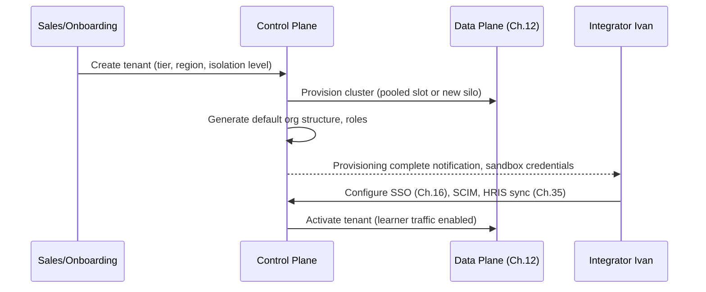

# Chapter 18 — Multi-tenancy

> Part III — Identity & Organization · [Index](../00-index.md) · Previous: [Ch. 17 — Authorization](17-authorization.md) · Next: Ch. 19 — Organization Hierarchy

## 1. Purpose

Chapter 12 already decided the *data-layer* tenant isolation model (hybrid silo/pool).
This chapter defines the *control-plane* tenancy architecture: provisioning lifecycle,
tenant configuration, the "dedicated-feeling" pattern flagged as Future Research in Chapter
1, and offboarding (Ch.5 Phase 10) — resolving Chapter 1's largest remaining Open Question.

## 2. Control Plane vs. Data Plane

| Plane | Responsibility | Owning Context (Ch.11) |
|---|---|---|
| Control plane | Tenant registry, provisioning workflow, configuration (feature flags, SSO config, region assignment), billing metadata | Tenancy & Provisioning (#3) |
| Data plane | The actual silo/pooled database clusters and services processing that tenant's learning data | All 17 contexts, scoped per §2 below |

A single global control plane governs routing to per-region, per-isolation-tier data
planes (Ch.12 §4 diagram) — this separation is what makes the hybrid model in Ch.12
operationally tractable: the control plane doesn't change per tenant, only the data-plane
routing target does.

## 3. Resolving the "Dedicated-Feeling Tenant" Pattern (Ch.1 Future Research)

Chapter 1 flagged that the largest enterprise buyers often want a deployment that *feels*
dedicated even within a multi-tenant architecture. Resolution: this is exactly what
Chapter 12's **silo tier** already provides at the data layer — a large/regulated tenant
gets a dedicated database cluster. This chapter extends the same principle to the control
plane's tenant-facing surface:

| Capability | Pooled Tenant | Silo ("Dedicated-Feeling") Tenant |
|---|---|---|
| Database | Shared cluster, RLS-isolated (Ch.12 §2) | Dedicated cluster |
| Compute | Shared autoscaling pool, rate-limited | Reserved capacity (Ch.15 §5) |
| Maintenance windows | Platform-wide schedule | Tenant-negotiable window |
| Custom domain / branding | Standard | Supported |
| Data residency guarantee | Region-level (Ch.12 §4) | Region-level, with option for dedicated-region-only routing guarantees in contract |
| Perceived isolation | Standard multi-tenant SaaS | Functionally indistinguishable from single-tenant, without the operational cost of true single-tenant deployment per customer |

This directly closes Chapter 1's Future Research item: the platform does not need a
separate "single-tenant product," because the silo tier already delivers the perceived
dedication the largest buyers want, within the same architecture and control plane.

## 4. Tenant Provisioning Lifecycle (Satisfies NFR-010)

Target: full sequence in under 4 hours (NFR-010) for pooled tenants; silo tenants may take
longer for dedicated cluster provisioning but the *control-plane* steps remain identical —
isolation tier should not require a fundamentally different onboarding process, only a
different data-plane target.

## 5. Tenant Offboarding (Realizes Ch.5 Phase 10)

Executes Chapter 5's offboarding phase and Chapter 12's identity/evidence separability
(ADR-018) at the tenant level: on contract termination, the tenant's data plane is
retained in a read-only archival state for the regulatory retention period (NFR-025), with
control-plane access revoked immediately — satisfying both "stop paying, stop accessing"
commercial expectations and "retain compliance evidence" regulatory obligations
simultaneously, without conflict, because Ch.12 §6 already separates identity from
evidence at the schema level.

## Summary
Multi-tenancy's control plane is architecturally separated from the data plane (Ch.12),
enabling a single provisioning/configuration model to route to either pooled or silo data
targets. This resolves Chapter 1's "dedicated-feeling tenant" Future Research item: the
silo tier already delivers perceived single-tenant dedication without a separate product
line. Provisioning targets NFR-010's 4-hour SLA for pooled tenants, and offboarding
executes Chapter 5's Phase 10 and Chapter 12's identity/evidence separability at the
tenant level.

## Open Questions
Whether silo-tenant provisioning should have its own, longer, explicitly-contracted SLA distinct from NFR-010's pooled-tenant target — deferred to [Ch. 46 — Licensing](../part-9-governance-future/46-licensing.md) as a contractual, not purely architectural, question.

## Risks
| Risk | Impact | Likelihood | Mitigation |
|---|---|---|---|
| Control plane becomes a single global point of failure for all tenant provisioning/config changes platform-wide | High | Low-Medium | [Ch. 42 — Disaster Recovery](../part-8-operations/42-disaster-recovery.md) must give the control plane its own explicit RTO/RPO treatment, separate from per-region data planes |
| Silo/pool tier migration (a growing tenant crossing the threshold, Ch.12 §2) has no defined process here | Medium | Medium | New requirement surfaced below |

## Architecture Decisions
**ADR-029: Control plane / data plane separation, with a single provisioning model routing to either pooled or silo data-plane targets** — §2–4. **ADR-030: Silo tier serves as the platform's answer to "dedicated-feeling" tenancy demand; no separate single-tenant product line** — §3, resolves Ch.1 Future Research.

## Future Research
- **New requirement surfaced:** define a pool-to-silo tenant migration process (a tenant crosses the Ch.12 §2 threshold organically) — assign to [Ch. 19](19-organization-hierarchy.md)/[Ch. 45](../part-8-operations/45-cost-optimization.md) as a joint concern (data migration mechanics + cost trigger).
- Control plane's own DR treatment (Ch.42).

## Cross References
[Ch. 1](../part-1-foundations/01-enterprise-lms-overview.md) (Future Research) · [Ch. 5](../part-1-foundations/05-learning-lifecycle.md) (Phase 10) · [Ch. 12](../part-2-system-domain-architecture/12-database-architecture.md) · [Ch. 42](../part-8-operations/42-disaster-recovery.md) · [Ch. 46](../part-9-governance-future/46-licensing.md)

## Definition of Done
- [x] Control/data plane separation defined
- [x] "Dedicated-feeling" tenant pattern resolved (closes Ch.1 Future Research)
- [x] Provisioning lifecycle diagrammed against NFR-010
- [x] Offboarding mechanics tied to Ch.5 Phase 10 and Ch.12 ADR-018

## Confidence Level
**High** — builds directly and consistently on already-approved Chapter 12 decisions rather than introducing new isolation-model debate.

## 6. Chapter Review

**Red Team:** Pool-to-silo migration is correctly flagged as missing, but assigning it
jointly to Ch.19/Ch.45 seems like a mismatch — neither chapter's core subject is
"live tenant data migration between isolation tiers." This risks the requirement being
silently dropped since it doesn't fit either chapter's natural scope.

**Blue Team:** Accepted — better home identified: this is fundamentally a
[Ch. 12 — Database Architecture](../part-2-system-domain-architecture/12-database-architecture.md) concern (it's a data
migration between database topologies), with [Ch. 45 — Cost Optimization](../part-8-operations/45-cost-optimization.md)
only as a secondary trigger-economics input. Corrected assignment below.

**CTO:** ADR-029/030 **Approved**. Action item reassigned: **[Ch. 12](../part-2-system-domain-architecture/12-database-architecture.md)**
(not Ch.19) must define the pool-to-silo live migration mechanism as a follow-up
deliverable; Ch.45 remains a secondary input on cost-trigger thresholds only.

---
*End of Chapter 18. Proceed to Chapter 19 — Organization Hierarchy.*
